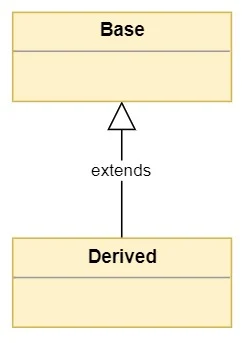
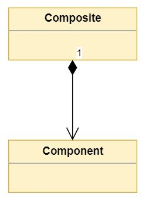
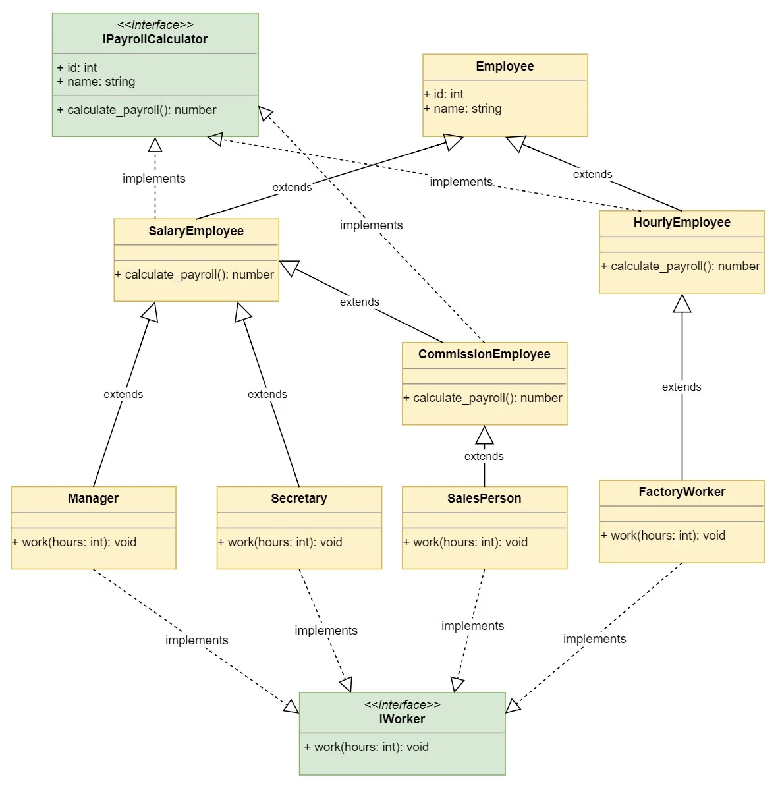
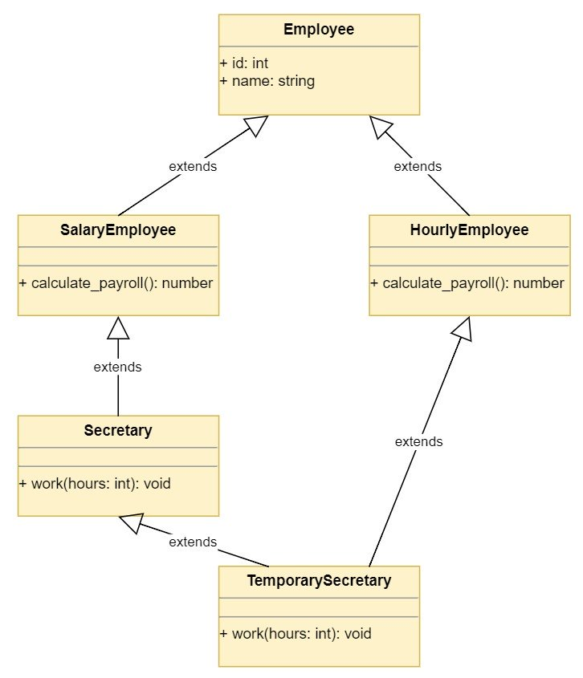
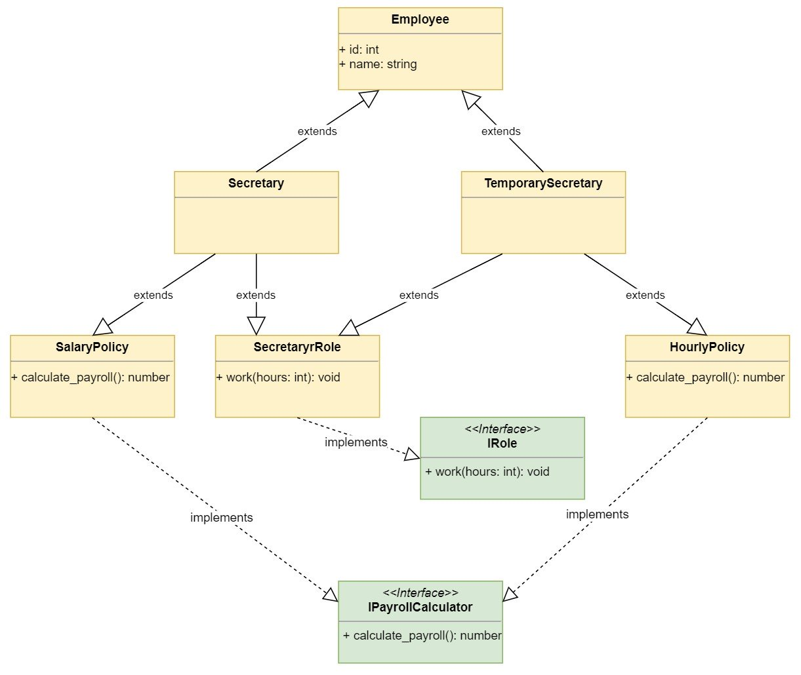
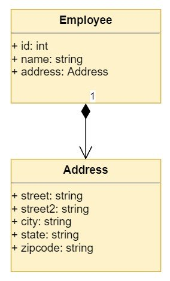
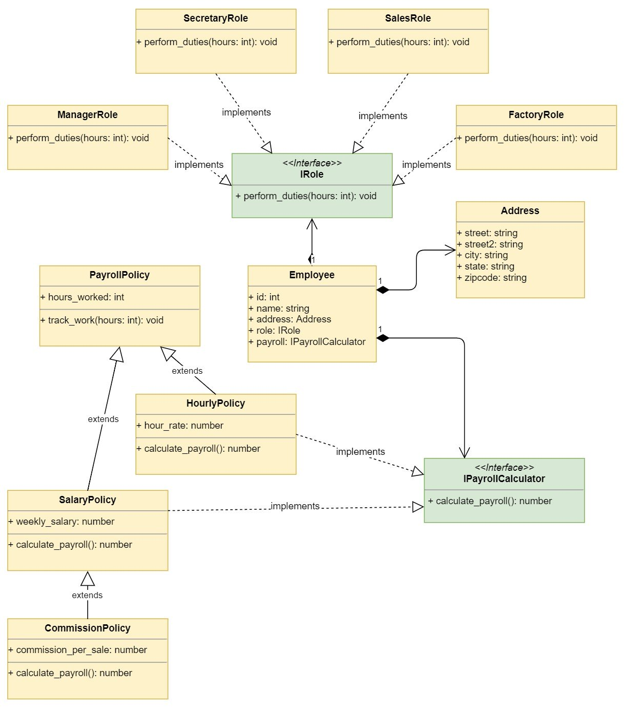

# 什么是继承
继承其实就是一种关系，这意味着，当您有一个继承自Base类的Derived类时，您创建了一个关系，其中Derived是Base的特殊版本



# 注意点
1. 从另一个继承的类称为派生类，子类或子类型
2. 派生其他类的类称为基类或超类
3. 派生类据说可以派生，继承或扩展基类

# 什么是组合
组合是一个概念，模型a有一个关系。它支持通过组合其他类型的对象来创建复杂类型。这意味着一个类组合可以包含另一个类组件的对象。这种关系意味着一个组合有一个组件



# 注意点

包含其他类的对象的类通常称为组合，其中用于创建更复杂类型的类称为组件

# Python继承概述

Python中的一切都是一个对象。模块是对象，类定义和函数是对象，当然，从类创建的对象也是对象

# 对象超类

首先编写尽可能简单的类

```python
class MyClass:
  pass
```
您声明了一个类MyClass，该类并没有做什么用，但它将说明最基本的继承概念。现在已经声明了类，可以使用`dir()`函数列出其成员了

```python
c = MyClass()
dir(c)
['__class__',
 '__delattr__',
 '__dict__',
 '__dir__',
 '__doc__',
 '__eq__',
 '__format__',
 '__ge__',
 '__getattribute__',
 '__gt__',
 '__hash__',
 '__init__',
 '__init_subclass__',
 '__le__',
 '__lt__',
 '__module__',
 '__ne__',
 '__new__',
 '__reduce__',
 '__reduce_ex__',
 '__repr__',
 '__setattr__',
 '__sizeof__',
 '__str__',
 '__subclasshook__',
 '__weakref__']
```

`dir()`返回指定对象中所有成员的列表。您尚未在MyClass中声明任何成员，因此列表来自何处？您可以使用交互式解释器进行查找

```python
o = object()
dir(o)

['__class__',
 '__delattr__',
 '__dir__',
 '__doc__',
 '__eq__',
 '__format__',
 '__ge__',
 '__getattribute__',
 '__gt__',
 '__hash__',
 '__init__',
 '__init_subclass__',
 '__le__',
 '__lt__',
 '__ne__',
 '__new__',
 '__reduce__',
 '__reduce_ex__',
 '__repr__',
 '__setattr__',
 '__sizeof__',
 '__str__',
 '__subclasshook__']
```

如您所见，这两个列表几乎相同。 MyClass中还有一些其他成员，除了__dict__和__weakref__，其他对象类的每个成员也都存在于MyClass中

# 众多异常也是异常

您在Python中创建的每个类都将从对象隐式派生。此规则的异常是用于通过引发异常来指示错误的类

您可以使用Python交互式解释器看到问题

```python
class MyError:
    pass
raise MyError()
```
您创建了一个新类来指示错误类型。然后尝试使用它来引发异常。抛出一个异常，但是输出声明该异常的类型是TypeError而不是MyError，并且所有异常都必须派生自BaseException

BaseException是为所有错误类型提供的基类。要创建新的错误类型，必须从BaseException或其派生类之一派生类。Python中的约定是从Exception派生自定义错误类型，而Exception又从BaseException派生自定义错误类型

定义错误类型的正确方法如下

```python
class MyError(Exception):
    pass
raise MyError()
```

# 创建类层次结构

继承是用来创建相关类的层次结构的机制。这些相关的类将共享一个公共接口，该接口将在基类中定义。派生类可以通过在应用时提供特定的实现来专门化接口

在本部分中，您将开始为人力资源系统建模。该示例将演示继承的用法以及派生类如何提供基类接口的具体实现

人力资源系统需要处理公司员工的薪资，但是根据员工薪资的计算方式，员工的类型有所不同

您从实现处理工资单的`PayrollSystem`类开始

```python
# in hr.py

class PayrollSystem:
  def calculate_payroll(self, employees):
    print('Calculating Payroll')
    print('===================')
    for employee in employees:
      print(f'Payroll for: {employee.id} - {employee.name}')
      print(f'- Check amount: {employee.calculate_payroll()}')
      print('')
```
`PayrollSystem`实现了一个`.calculate_payroll()`方法，该方法获取一组雇员，并使用暴露在每个雇员对象上的`.calculate_payroll()`方法来打印其ID，姓名和支票金额

现在，您实现一个基类Employee，该基类处理每种员工类型的通用接口

```python
# in hr.py

class Employee:
  def __init__(self, id, name):
    self.id = id
    self.name = name
```
雇员是所有雇员类型的基类。它由一个id和一个名称构成。您的意思是，每个员工都必须分配一个ID和一个名称

人力资源系统要求每个处理过的员工必须提供一个`.calculate_payroll()`接口，该接口返回该员工的每周薪水。该接口的实现因`Employee`类型而异

```python
# in hr.py
class SalaryEmployee(Employee):
  def __init__(self, id, name, weekly_salary):
    super().__init__(id, name)
    self.weekly_salary = weekly_salary

  def calculate_payroll(self):
    return self.weekly_salary
```
创建继承`Employee`的派生类`SalaryEmployee`。使用基类所需的id和名称初始化类，并使用`super()`初始化基类的成员。你可以在用`Python super()`来增强你的类中读到关于`super()`的所有信息


`SalaryEmployee`还需要一个`weekly_salary`初始化参数，该参数表示该雇员每周的收入

该类提供了HR系统使用的必需`.calculate_payroll()`方法。该实现只返回存储在`weekly_salary`中的金额

该公司还雇用按小时支付的制造工人，因此您将一个`HourlyEmployee`添加到HR系统

```python
class HourlyEmployee(Employee):
  def __init__(self, id, name, hours, hours_worked, hour_rate):
    super().__init__(id, name)
    self.hours_worked = hours_worked
    self.hour_rate = hour_rate
  def calculate_payroll(self):
    return self.hours_worked * self.hour_rate
```

`HourlyEmployee`类是用id和名称初始化的，就像基类一样，加上`hours_worked`和`hour_rate`来计算工薪表。`calculate_payroll()`方法是通过返回工作时间乘以小时率来实现的

最终，公司雇用了销售员工，他们的薪水是固定的，再加上基于其销售的佣金，因此您可以创建`CommissionEmployee`类

```python
# In hr.py

class CommissionEmployee(SalaryEmployee):
    def __init__(self, id, name, weekly_salary, commission):
        super().__init__(id, name, weekly_salary)
        self.commission = commission

    def calculate_payroll(self):
        fixed = super().calculate_payroll()
        return fixed + self.commission
```
你可以从`SalaryEmployee`中获取佣金，因为这两个类都有一周的薪水要考虑。同时，根据雇员的销售额初始化一个`commission`值

`.calculate_payroll()`利用基类的实现来检索固定工资并添加佣金值

因为`CommissionEmployee`派生自`SalaryEmployee`，所以您可以直接访问`weekly_salary`属性，并且可以使用该属性的值实现`.calculate_payroll()`

直接访问该属性的问题是，如果`SalaryEmployee.calculate_payroll()`的实现发生了更改，那么您还必须更改`CommissionEmployee.calculate_payroll()`的实现。更好的方法是依赖于基类中已经实现的方法，并根据需要扩展功能

您为系统创建了一流的层次结构。类的UML图如下所示


该图显示了类的继承层次结构。派生类实现了`payrollcalculator`接口，这是`PayrollSystem`所需要的。实现`PayrollSystem.calculate_payroll()`要求传递的雇员对象包含id、名称和`calculate_payroll()`实现。


接口的表示类似于类，接口名称上方带有单词`interface`。接口名称通常以大写字母I开头

该应用程序创建其员工，并将其传递到薪资系统以处理薪资

```python
# In program.py

import hr

salary_employee = hr.SalaryEmployee(1, 'John Smith', 1500)
hourly_employee = hr.HourlyEmployee(2, 'Jane Doe', 40, 15)
commission_employee = hr.CommissionEmployee(3, 'Kevin Bacon', 1000, 250)
payroll_system = hr.PayrollSystem()
payroll_system.calculate_payroll([
    salary_employee,
    hourly_employee,
    commission_employee
])
```
您可以在命令行中运行程序并查看结果

```python
python program.py

Calculating Payroll
===================
Payroll for: 1 - John Smith
- Check amount: 1500

Payroll for: 2 - Jane Doe
- Check amount: 600

Payroll for: 3 - Kevin Bacon
- Check amount: 1250
```
该程序创建三个`employee`对象，每个派生类一个。然后，它创建工资单系统，并将员工列表传递给它的`.calculate_payroll()`方法，该方法计算每个员工的工资单并打印结果

注意`Employee`基类没有定义`.calculate_payroll()`方法。这意味着，如果您要创建一个普通的Employee对象并将其传递给`PayrollSystem`，那么您将得到一个错误。您可以在Python交互式解释器中尝试它

```python
import hr
employee = hr.Employee(1, 'Invalid')
payroll_system = hr.PayrollSystem()
payroll_system.calculate_payroll([employee])
```

虽然可以实例化`Employee`对象，但`PayrollSystem`不能使用该对象。为什么?因为它不能为雇员使用`.calculate_payroll()`。为了满足`PayrollSystem`的需求，您需要将`Employee`类(目前是一个具体类)转换为一个抽象类。这样，任何雇员都不是雇员，而是实现`.calculate_payroll()`的雇员。


# Python中的抽象基类

上面示例中的`Employee`类是所谓的抽象基类。存在要继承的抽象基类，但从未实例化。 `Python`提供了`abc`模块来定义抽象基类

`Python`标准库中的`abc`模块提供了防止从抽象基类创建对象的功能

您可以修改`Employee`类的实现，以确保无法实例化它

```python
# In hr.py

from abc import ABC, abstractmethod

class Employee(ABC):
    def __init__(self, id, name):
        self.id = id
        self.name = name

    @abstractmethod
    def calculate_payroll(self):
        pass
```
您从`ABC`派生`Employee`，使其成为抽象的基类。然后，使用`@abstractmethod`装饰器装饰`.calculate_payroll()`方法

这种变化有两个很好的副作用

1. 您是在告诉模块用户不能创建`Employee`类型的对象
2. 您是在告诉hr模块上的其他开发人员，如果他们是从`Employee`派生的，那么他们必须重写`.calculate_payroll()`抽象方法

```python
import hr
employee = hr.Employee(1, 'abstract')
```

输出显示该类无法实例化，因为它包含抽象方法`calculate_payroll()`。派生类必须重写方法以允许创建其类型的对象

# 实现继承与接口继承

当您从另一个类派生一个类时，派生类会继承这两个类
1. 基类接口：派生类继承基类的所有方法，属性和属性
2. 基类实现：派生类继承实现类接口的代码

大多数时候，您会希望继承一个类的实现，但是您将希望实现多个接口，因此您的对象可以在不同的情况下使用

现代编程语言的设计考虑了这一基本概念。它们允许您从单个类继承，但可以实现多个接口

在`Python`中，您不必显式地声明接口。实现所需接口的任何对象都可以用来替代另一个对象。这就是所谓的鸭子类型。`Duck typing`通常被解释为“如果它的行为像鸭子，那么它就是鸭子”

为了说明这一点，您现在将在上面的示例中添加一个`DisgruntledEmployee`类，它不是从`Employee`派生的

```python
# In disgruntled.py

class DisgruntledEmployee:
    def __init__(self, id, name):
        self.id = id
        self.name = name

    def calculate_payroll(self):
        return 1000000
```

`DisgruntledEmployee`类不是从`Employee`派生的，但是它公开了`PayrollSystem`所需的相同接口。 `PayrollSystem.calculate_payroll()`需要实现以下接口的对象列表

您可以修改程序以使用`DisgruntledEmployee`类
```python
# In program.py

import hr
import disgruntled

salary_employee = hr.SalaryEmployee(1, 'John Smith', 1500)
hourly_employee = hr.HourlyEmployee(2, 'Jane Doe', 40, 15)
commission_employee = hr.CommissionEmployee(3, 'Kevin Bacon', 1000, 250)
disgruntled_employee = disgruntled.DisgruntledEmployee(20000, 'Anonymous')
payroll_system = hr.PayrollSystem()
payroll_system.calculate_payroll([
    salary_employee,
    hourly_employee,
    commission_employee,
    disgruntled_employee
])
```

运行程序输出如下

```python
$ python program.py

Calculating Payroll
===================
Payroll for: 1 - John Smith
- Check amount: 1500

Payroll for: 2 - Jane Doe
- Check amount: 600

Payroll for: 3 - Kevin Bacon
- Check amount: 1250

Payroll for: 20000 - Anonymous
- Check amount: 1000000
```

如您所见，`PayrollSystem`仍然可以处理新对象，因为它符合所需的接口

由于您不必从特定的类派生对象就可以被程序重用，因此您可能会问为什么应该使用继承而不是仅实现所需的接口。以下规则可能对您有帮助

1. 使用继承来重用实现:您的派生类应该利用它们的大部分基类实现。他们还必须为is a relationship建模。客户类也可能有一个id和一个名称，但是客户不是雇员，所以您不应该使用继承。

2. 实施要重用的接口：当您希望类被应用程序的特定部分重用时，您可以在类中实现所需的接口，但是无需提供基类或从另一个类继承

```python
# In hr.py

class PayrollSystem:
    def calculate_payroll(self, employees):
        print('Calculating Payroll')
        print('===================')
        for employee in employees:
            print(f'Payroll for: {employee.id} - {employee.name}')
            print(f'- Check amount: {employee.calculate_payroll()}')
            print('')

class Employee:
    def __init__(self, id, name):
        self.id = id
        self.name = name

class SalaryEmployee(Employee):
    def __init__(self, id, name, weekly_salary):
        super().__init__(id, name)
        self.weekly_salary = weekly_salary

    def calculate_payroll(self):
        return self.weekly_salary

class HourlyEmployee(Employee):
    def __init__(self, id, name, hours_worked, hour_rate):
        super().__init__(id, name)
        self.hours_worked = hours_worked
        self.hour_rate = hour_rate

    def calculate_payroll(self):
        return self.hours_worked * self.hour_rate

class CommissionEmployee(SalaryEmployee):
    def __init__(self, id, name, weekly_salary, commission):
        super().__init__(id, name, weekly_salary)
        self.commission = commission

    def calculate_payroll(self):
        fixed = super().calculate_payroll()
        return fixed + self.commission
```
您删除了`abc`模块的导入，因为`Employee`类不需要是抽象的。您还从其中删除了抽象的`calculate_payroll()`方法，因为它不提供任何实现

基本上，您继承了派生类中`Employee`类的id和name属性的实现。因为`.calculate_payroll()`只是`PayrollSystem.calculate_payroll()`方法的一个接口，所以不需要在`Employee`基类中实现它

注意`commission`类是如何从`SalaryEmployee`派生出来的。这意味着`commonemployee`继承了`SalaryEmployee`的实现和接口。可以看到，`calculate_payroll()`方法如何利用基类实现，因为它依赖于`super().calculate_payroll()`的结果来实现自己的版本

# 类爆炸问题
如果您不小心，继承会导致您进入难以理解和维护的巨大的类层次结构。这称为类爆炸问题

您开始构建薪资系统用于计算薪资的`Employee`类型的类层次结构。现在，您需要向这些类添加一些功能，以便它们可以与新的`ProductivitySystem`一起使用

`ProductivitySystem`根据员工角色跟踪生产力。有不同的员工角色


1. 经理：他们四处走走，大喊大叫，告诉他们该怎么做。他们是受薪雇员，可赚更多钱
2. 秘书：他们为经理完成所有书面工作，并确保一切按时计费和付款。他们也是受薪员工，但赚的钱少
3. 销售员工：他们打很多电话来销售产品。他们有薪水，但他们也会得到销售佣金

4. 工厂工人：他们为公司生产产品。他们按小时支付

有了这些要求，您开始发现`Employee`及其派生类可能属于hr模块之外的其他位置，因为现在`ProductivitySystem`也使用了它们

您创建一个`employees`模块并将类移到那里

```python
# In employees.py

class Employee:
    def __init__(self, id, name):
        self.id = id
        self.name = name

class SalaryEmployee(Employee):
    def __init__(self, id, name, weekly_salary):
        super().__init__(id, name)
        self.weekly_salary = weekly_salary

    def calculate_payroll(self):
        return self.weekly_salary

class HourlyEmployee(Employee):
    def __init__(self, id, name, hours_worked, hour_rate):
        super().__init__(id, name)
        self.hours_worked = hours_worked
        self.hour_rate = hour_rate

    def calculate_payroll(self):
        return self.hours_worked * self.hour_rate

class CommissionEmployee(SalaryEmployee):
    def __init__(self, id, name, weekly_salary, commission):
        super().__init__(id, name, weekly_salary)
        self.commission = commission

    def calculate_payroll(self):
        fixed = super().calculate_payroll()
        return fixed + self.commission
```

实现保持不变，但是将类移动到`employee`模块。现在，您更改您的程序以支持更改

```python
# In program.py

import hr
import employees

salary_employee = employees.SalaryEmployee(1, 'John Smith', 1500)
hourly_employee = employees.HourlyEmployee(2, 'Jane Doe', 40, 15)
commission_employee = employees.CommissionEmployee(3, 'Kevin Bacon', 1000, 250)
payroll_system = hr.PayrollSystem()
payroll_system.calculate_payroll([
    salary_employee,
    hourly_employee,
    commission_employee
])
```

您运行该程序并验证它仍然可以工作
```python
$ python program.py

Calculating Payroll
===================
Payroll for: 1 - John Smith
- Check amount: 1500

Payroll for: 2 - Jane Doe
- Check amount: 600

Payroll for: 3 - Kevin Bacon
- Check amount: 1250
```

一切就绪后，您就可以开始添加新类了

```python
# In employees.py

class Manager(SalaryEmployee):
    def work(self, hours):
        print(f'{self.name} screams and yells for {hours} hours.')

class Secretary(SalaryEmployee):
    def work(self, hours):
        print(f'{self.name} expends {hours} hours doing office paperwork.')

class SalesPerson(CommissionEmployee):
    def work(self, hours):
        print(f'{self.name} expends {hours} hours on the phone.')

class FactoryWorker(HourlyEmployee):
    def work(self, hours):
        print(f'{self.name} manufactures gadgets for {hours} hours.')
```
首先，添加一个从`SalaryEmployee`派生的`Manager`类。该类公开了将由生产力系统使用的`work（）`方法。该方法占用员工工作时间

然后添加`Secretary`，`SalesPerson`和`FactoryWorker`，然后实现`work（）`接口，以便生产力系统可以使用它们。

现在，您可以添加`ProductivitySytem`类

```python
# In productivity.py

class ProductivitySystem:
    def track(self, employees, hours):
        print('Tracking Employee Productivity')
        print('==============================')
        for employee in employees:
            employee.work(hours)
        print('')
```
该类使用`track（）`方法跟踪员工，该方法获取员工列表和要跟踪的小时数。您现在可以将生产力系统添加到程序中

```python
# In program.py

import hr
import employees
import productivity

manager = employees.Manager(1, 'Mary Poppins', 3000)
secretary = employees.Secretary(2, 'John Smith', 1500)
sales_guy = employees.SalesPerson(3, 'Kevin Bacon', 1000, 250)
factory_worker = employees.FactoryWorker(2, 'Jane Doe', 40, 15)
employees = [
    manager,
    secretary,
    sales_guy,
    factory_worker,
]
productivity_system = productivity.ProductivitySystem()
productivity_system.track(employees, 40)
payroll_system = hr.PayrollSystem()
payroll_system.calculate_payroll(employees)
```

该程序将创建不同类型的员工列表。员工名单被发送到生产力系统以跟踪他们40个小时的工作。然后，将相同的员工列表发送到薪资系统以计算其薪资

```python
$ python program.py

Tracking Employee Productivity
==============================
Mary Poppins screams and yells for 40 hours.
John Smith expends 40 hours doing office paperwork.
Kevin Bacon expends 40 hours on the phone.
Jane Doe manufactures gadgets for 40 hours.

Calculating Payroll
===================
Payroll for: 1 - Mary Poppins
- Check amount: 3000

Payroll for: 2 - John Smith
- Check amount: 1500

Payroll for: 3 - Kevin Bacon
- Check amount: 1250

Payroll for: 4 - Jane Doe
- Check amount: 600
```

该程序显示员工通过生产力系统工作40个小时。然后计算并显示每个员工的工资单

程序按预期工作，但是您必须添加四个新类来支持更改。随着新需求的出现，您的类层次结构将不可避免地增长，从而导致类爆炸问题，您的层次结构将变得非常大，以至于难以理解和维护

下图显示了新的类层次结构



# 继承多个类

`python`是少数支持多重继承的现代编程语言之一。多重继承是同时从多个基类派生一个类的能力

多重继承的名声很坏，以至于大多数现代编程语言都不支持它。相反，现代编程语言支持接口的概念。在这些语言中，您从单个基类继承，然后实现多个接口，因此您的类可以在不同的情况下重用

这种方法给您的设计带来了一些限制。您只能通过直接派生一个类来继承该类的实现。您可以实现多个接口，但不能继承多个类的实现

这个约束对软件设计是有好处的，因为它迫使您在设计类时减少相互之间的依赖。您将在本文后面看到，您可以通过组合利用多个实现，这使得软件更加灵活。然而，这一节是关于多重继承的，所以让我们来看看它是如何工作的

事实证明，有时临时秘书是在有太多文书工作要做的时候才被雇佣的。临时秘书类在生产力系统的上下文中扮演秘书的角色，但出于工资单的目的，它是`HourlyEmployee`

派生自`Secretary`:您可以派生自`Secretary`，以继承角色的`.work()`方法，然后覆盖`.calculate_payroll()`方法，将其实现为`HourlyEmployee`

从`HourlyEmployee`派生：您可以从`HourlyEmployee`派生以继承`.calculate_payroll（）`方法，然后重写`.work（）`方法以将其实现为秘书

```python
# In employees.py

class TemporarySecretary(Secretary, HourlyEmployee):
    pass
```
Python允许您通过在类声明中的括号之间指定它们来从两个不同的类继承

现在，您修改程序以添加新的临时秘书员工
```python
import hr
import employees
import productivity

manager = employees.Manager(1, 'Mary Poppins', 3000)
secretary = employees.Secretary(2, 'John Smith', 1500)
sales_guy = employees.SalesPerson(3, 'Kevin Bacon', 1000, 250)
factory_worker = employees.FactoryWorker(4, 'Jane Doe', 40, 15)
temporary_secretary = employees.TemporarySecretary(5, 'Robin Williams', 40, 9)
company_employees = [
    manager,
    secretary,
    sales_guy,
    factory_worker,
    temporary_secretary,
]
productivity_system = productivity.ProductivitySystem()
productivity_system.track(company_employees, 40)
payroll_system = hr.PayrollSystem()
payroll_system.calculate_payroll(company_employees)
```
运行程序
```python
$ python program.py

Traceback (most recent call last):
 File ".\program.py", line 9, in <module>
  temporary_secretary = employee.TemporarySecretary(5, 'Robin Williams', 40, 9)
TypeError: __init__() takes 4 positional arguments but 5 were given
```
您会收到一个TypeError异常，该异常表示应有4个位置参数，但给出了5个

这是因为您首先从秘书中派生了`TemporarySecretary`，然后从`HourlyEmployee`中派生了，所以解释器试图使用`Secretary .__ init __（）`来初始化对象。

好吧，我们扭转一下

```python
class TemporarySecretary(HourlyEmployee, Secretary):
    pass
```

运行程序

```python
$ python program.py

Traceback (most recent call last):
 File ".\program.py", line 9, in <module>
  temporary_secretary = employee.TemporarySecretary(5, 'Robin Williams', 40, 9)
 File "employee.py", line 16, in __init__
  super().__init__(id, name)
TypeError: __init__() missing 1 required positional argument: 'weekly_salary'
```

现在看来，您缺少了一个周秘书参数，该参数对于初始化局长是必需的，但是在`TemporarySecretary`的上下文中该参数没有意义，因为它是`HourlyEmployee`

也许实现`TemporarySecretary .__ init __（）`会有所帮助

```python
# In employees.py

class TemporarySecretary(HourlyEmployee, Secretary):
    def __init__(self, id, name, hours_worked, hour_rate):
        super().__init__(id, name, hours_worked, hour_rate)
```

try it

```python
$ python program.py

Traceback (most recent call last):
 File ".\program.py", line 9, in <module>
  temporary_secretary = employee.TemporarySecretary(5, 'Robin Williams', 40, 9)
 File "employee.py", line 54, in __init__
  super().__init__(id, name, hours_worked, hour_rate)
 File "employee.py", line 16, in __init__
  super().__init__(id, name)
TypeError: __init__() missing 1 required positional argument: 'weekly_salary'
```

这也不管用。好了，现在是深入研究Python的方法解析顺序(MRO)的时候了，看看发生了什么

当访问类的方法或属性时，`Python`使用类`MRO`来查找它。`super()`还使用`MRO`来确定调用哪个方法或属性。您可以使用`Python super()`在`Supercharge`类中了解关于`super()`的更多信息

```python
from employees import TemporarySecretary
TemporarySecretary.__mro__

(<class 'employees.TemporarySecretary'>,
 <class 'employees.HourlyEmployee'>,
 <class 'employees.Secretary'>,
 <class 'employees.SalaryEmployee'>,
 <class 'employees.Employee'>,
 <class 'object'>
)
```

MRO显示Python查找匹配的属性或方法的顺序。在示例中，这就是我们创建TemporarySecretary对象时发生的情况

1. 调用`TemporarySecretary .__ init __（self，id，name，hours_worked，hour_rate）`方法
2. `super（）.__ init __（id，name，hours_worked，hour_rate）`调用与`HourlyEmployee .__ init __（self，id，name，hour_worked，hour_rate）`
3. `HourlyEmployee`调用`super（）.__ init __（id，name）`，MRO将与秘书匹配。`秘书.__ init __（）`，它继承自`SalaryEmployee .__ init __（self，id，name，weekly_salary）`

由于参数不匹配，因此引发TypeError异常

您可以通过反转继承顺序并直接调用`HourlyEmployee .__ init __（）`来绕过MRO，如下所示

```python
class TemporarySecretary(Secretary, HourlyEmployee):
    def __init__(self, id, name, hours_worked, hour_rate):
        HourlyEmployee.__init__(self, id, name, hours_worked, hour_rate)
```
这就解决了创建对象的问题，但是在尝试计算薪资时会遇到类似的问题。您可以运行该程序以查看问题

```python
$ python program.py

Tracking Employee Productivity
==============================
Mary Poppins screams and yells for 40 hours.
John Smith expends 40 hours doing office paperwork.
Kevin Bacon expends 40 hours on the phone.
Jane Doe manufactures gadgets for 40 hours.
Robin Williams expends 40 hours doing office paperwork.

Calculating Payroll
===================
Payroll for: 1 - Mary Poppins
- Check amount: 3000

Payroll for: 2 - John Smith
- Check amount: 1500

Payroll for: 3 - Kevin Bacon
- Check amount: 1250

Payroll for: 4 - Jane Doe
- Check amount: 600

Payroll for: 5 - Robin Williams
Traceback (most recent call last):
  File ".\program.py", line 20, in <module>
    payroll_system.calculate_payroll(employees)
  File "hr.py", line 7, in calculate_payroll
    print(f'- Check amount: {employee.calculate_payroll()}')
  File "employee.py", line 12, in calculate_payroll
    return self.weekly_salary
AttributeError: 'TemporarySecretary' object has no attribute 'weekly_salary'
```

现在的问题是，由于您颠倒了继承顺序，MRO将在`HourlyEmployee`中的`SalariedEmployee`方法之前找到`SalariedEmployee`的`.calculate_payroll()`方法。您需要在`TemporarySecretary`中覆盖`.calculate_payroll()`并从中调用正确的实现

```python
class TemporarySecretary(Secretary, HourlyEmployee):
    def __init__(self, id, name, hours_worked, hour_rate):
        HourlyEmployee.__init__(self, id, name, hours_worked, hour_rate)

    def calculate_payroll(self):
        return HourlyEmployee.calculate_payroll(self)
```

`compute_payroll（）`方法直接调用`HourlyEmployee.calculate_payroll（）`以确保获得正确的结果。您可以再次运行该程序以查看其是否正常运行

```python
$ python program.py

Tracking Employee Productivity
==============================
Mary Poppins screams and yells for 40 hours.
John Smith expends 40 hours doing office paperwork.
Kevin Bacon expends 40 hours on the phone.
Jane Doe manufactures gadgets for 40 hours.
Robin Williams expends 40 hours doing office paperwork.

Calculating Payroll
===================
Payroll for: 1 - Mary Poppins
- Check amount: 3000

Payroll for: 2 - John Smith
- Check amount: 1500

Payroll for: 3 - Kevin Bacon
- Check amount: 1250

Payroll for: 4 - Jane Doe
- Check amount: 600

Payroll for: 5 - Robin Williams
- Check amount: 360
```

程序现在可以正常工作了，因为您可以通过显式地告诉解释器我们想要使用哪个方法来强制方法解析顺序。


正如您所看到的，多重继承可能令人困惑，特别是当您遇到`diamond`问题时



该图显示了当前类设计的`diamond`问题。`TemporarySecretary`使用多重继承派生自两个类，这两个类最终也派生自`Employee`。这将导致两条路径到达`Employee`基类，这是您希望在设计中避免的

当您使用多重继承并从两个具有公共基类的类派生时，`diamond`问题就会出现。这可能导致调用方法的错误版本

正如您所看到的，Python提供了一种方法来强制调用正确的方法，并且分析MRO可以帮助您理解问题

`Employee`派生类由两个不同的系统使用

1. 跟踪员工生产力的生产力系统
2. 计算员工薪资的薪资系统

这意味着与生产力相关的所有内容都应该放在一个模块中，而与工资相关的所有内容都应该放在另一个模块中。您可以开始更改生产力模块

```python
# In productivity.py

class ProductivitySystem:
    def track(self, employees, hours):
        print('Tracking Employee Productivity')
        print('==============================')
        for employee in employees:
            result = employee.work(hours)
            print(f'{employee.name}: {result}')
        print('')

class ManagerRole:
    def work(self, hours):
        return f'screams and yells for {hours} hours.'

class SecretaryRole:
    def work(self, hours):
        return f'expends {hours} hours doing office paperwork.'

class SalesRole:
    def work(self, hours):
        return f'expends {hours} hours on the phone.'

class FactoryRole:
    def work(self, hours):
        return f'manufactures gadgets for {hours} hours.'
```

生产力模块实现`ProductivitySystem`类及其支持的相关角色。这些类实现了系统所需的`work（）`接口，但它们不是从`Employee`派生的

```python
# In hr.py

class PayrollSystem:
    def calculate_payroll(self, employees):
        print('Calculating Payroll')
        print('===================')
        for employee in employees:
            print(f'Payroll for: {employee.id} - {employee.name}')
            print(f'- Check amount: {employee.calculate_payroll()}')
            print('')

class SalaryPolicy:
    def __init__(self, weekly_salary):
        self.weekly_salary = weekly_salary

    def calculate_payroll(self):
        return self.weekly_salary

class HourlyPolicy:
    def __init__(self, hours_worked, hour_rate):
        self.hours_worked = hours_worked
        self.hour_rate = hour_rate

    def calculate_payroll(self):
        return self.hours_worked * self.hour_rate

class CommissionPolicy(SalaryPolicy):
    def __init__(self, weekly_salary, commission):
        super().__init__(weekly_salary)
        self.commission = commission

    def calculate_payroll(self):
        fixed = super().calculate_payroll()
        return fixed + self.commission
```

hr模块实现了`PayrollSystem`，该系统为员工计算工资。它还实现了工资单的策略类。如您所见，策略类别不再源自`Employee`

```python
# In employees.py

from hr import (
    SalaryPolicy,
    CommissionPolicy,
    HourlyPolicy
)
from productivity import (
    ManagerRole,
    SecretaryRole,
    SalesRole,
    FactoryRole
)

class Employee:
    def __init__(self, id, name):
        self.id = id
        self.name = name

class Manager(Employee, ManagerRole, SalaryPolicy):
    def __init__(self, id, name, weekly_salary):
        SalaryPolicy.__init__(self, weekly_salary)
        super().__init__(id, name)

class Secretary(Employee, SecretaryRole, SalaryPolicy):
    def __init__(self, id, name, weekly_salary):
        SalaryPolicy.__init__(self, weekly_salary)
        super().__init__(id, name)

class SalesPerson(Employee, SalesRole, CommissionPolicy):
    def __init__(self, id, name, weekly_salary, commission):
        CommissionPolicy.__init__(self, weekly_salary, commission)
        super().__init__(id, name)

class FactoryWorker(Employee, FactoryRole, HourlyPolicy):
    def __init__(self, id, name, hours_worked, hour_rate):
        HourlyPolicy.__init__(self, hours_worked, hour_rate)
        super().__init__(id, name)

class TemporarySecretary(Employee, SecretaryRole, HourlyPolicy):
    def __init__(self, id, name, hours_worked, hour_rate):
        HourlyPolicy.__init__(self, hours_worked, hour_rate)
        super().__init__(id, name)
```

`employees`模块从其他模块导入策略和角色，并实现不同的`Employee`类型。您仍然使用多重继承来继承`salary`策略类和`productivity`角色的实现，但是每个类的实现只需要处理初始化

注意，您仍然需要在构造函数中显式地初始化薪水策略。您可能看到`Manager和Secretary`的初始化是相同的。另外，`factory - worker`和`TemporarySecretary`的初始化是相同的

您将不希望在更复杂的设计中使用这种代码重复，因此在设计类层次结构时必须小心



运行程序

```python
$ python program.py

Tracking Employee Productivity
==============================
Mary Poppins: screams and yells for 40 hours.
John Smith: expends 40 hours doing office paperwork.
Kevin Bacon: expends 40 hours on the phone.
Jane Doe: manufactures gadgets for 40 hours.
Robin Williams: expends 40 hours doing office paperwork.

Calculating Payroll
===================
Payroll for: 1 - Mary Poppins
- Check amount: 3000

Payroll for: 2 - John Smith
- Check amount: 1500

Payroll for: 3 - Kevin Bacon
- Check amount: 1250

Payroll for: 4 - Jane Doe
- Check amount: 600

Payroll for: 5 - Robin Williams
- Check amount: 360
```

# python 中的 组合

组合是一个面向对象的设计概念，模型a是有关系的。在composition中，一个称为composite的类包含另一个称为component的类的对象。换句话说，一个复合类有另一个类的组件

组合允许复合类重用其包含的组件的实现。复合类不继承组件类的接口，但可以利用其实现

两类之间的构成关系被认为是松散耦合的。这意味着对组件类的更改很少会影响组合类，而对复合类的更改则永远不会影响组件类

这提供了更好的变更适应性，并允许应用程序引入新的要求而不会影响现有代码

当查看两种竞争软件设计时，一种基于继承，另一种基于组成，那么组成解决方案通常是最灵活的。您现在可以查看合成的工作原理

您已经在我们的示例中使用了合成。如果您查看`Employee`类，则会看到它包含两个属性

```python
# In contacts.py

class Address:
    def __init__(self, street, city, state, zipcode, street2=''):
        self.street = street
        self.street2 = street2
        self.city = city
        self.state = state
        self.zipcode = zipcode

    def __str__(self):
        lines = [self.street]
        if self.street2:
            lines.append(self.street2)
        lines.append(f'{self.city}, {self.state} {self.zipcode}')
        return '\n'.join(lines)
```
您实现了一个基本地址类，其中包含地址的常用组件。您将street2属性设置为可选，因为并非所有地址都具有该组件


您实现了`__str __（）`来提供地址的漂亮表示。您可以在交互式解释器中看到此实现

```python
from contacts import Address
address = Address('55 Main St.', 'Concord', 'NH', '03301')
print(address)
```
当您打印`address`变量时，会调用特殊的方法`__str__()`。因为您重载了方法来返回一个格式化为地址的字符串，所以您得到了一个很好的、可读的表示。自定义Python类中的操作符和函数重载很好地概述了类中可用的特殊方法，这些方法可用于自定义对象的行为

```python
# In employees.py

class Employee:
    def __init__(self, id, name):
        self.id = id
        self.name = name
        self.address = None
```

您现在将`address`属性初始化为`None`使其成为可选，但是通过这样做，您现在可以将一个`Address`分配给`Employee`。还请注意，`employee`模块中没有对`contact`模块的引用

复合是一种松散耦合的关系，通常不需要复合类具有组件的知识



```python
# In hr.py

class PayrollSystem:
    def calculate_payroll(self, employees):
        print('Calculating Payroll')
        print('===================')
        for employee in employees:
            print(f'Payroll for: {employee.id} - {employee.name}')
            print(f'- Check amount: {employee.calculate_payroll()}')
            if employee.address:
                print('- Sent to:')
                print(employee.address)
            print('')
```

您检查以查看雇员对象是否有地址，如果有，则将其打印出来。现在，您可以修改程序以为员工分配一些地址

```python
# In program.py

import hr
import employees
import productivity
import contacts

manager = employees.Manager(1, 'Mary Poppins', 3000)
manager.address = contacts.Address(
    '121 Admin Rd', 
    'Concord', 
    'NH', 
    '03301'
)
secretary = employees.Secretary(2, 'John Smith', 1500)
secretary.address = contacts.Address(
    '67 Paperwork Ave.', 
    'Manchester', 
    'NH', 
    '03101'
)
sales_guy = employees.SalesPerson(3, 'Kevin Bacon', 1000, 250)
factory_worker = employees.FactoryWorker(4, 'Jane Doe', 40, 15)
temporary_secretary = employees.TemporarySecretary(5, 'Robin Williams', 40, 9)
employees = [
    manager,
    secretary,
    sales_guy,
    factory_worker,
    temporary_secretary,
]
productivity_system = productivity.ProductivitySystem()
productivity_system.track(employees, 40)
payroll_system = hr.PayrollSystem()
payroll_system.calculate_payroll(employees)
```

您向经理和秘书对象添加了两个地址。运行程序时，您将看到打印的地址

```python
$ python program.py

Tracking Employee Productivity
==============================
Mary Poppins: screams and yells for {hours} hours.
John Smith: expends {hours} hours doing office paperwork.
Kevin Bacon: expends {hours} hours on the phone.
Jane Doe: manufactures gadgets for {hours} hours.
Robin Williams: expends {hours} hours doing office paperwork.

Calculating Payroll
===================
Payroll for: 1 - Mary Poppins
- Check amount: 3000
- Sent to:
121 Admin Rd
Concord, NH 03301

Payroll for: 2 - John Smith
- Check amount: 1500
- Sent to:
67 Paperwork Ave.
Manchester, NH 03101

Payroll for: 3 - Kevin Bacon
- Check amount: 1250

Payroll for: 4 - Jane Doe
- Check amount: 600

Payroll for: 5 - Robin Williams
- Check amount: 360
```

请注意，经理和秘书对象的工资单输出如何显示支票发送的地址

`Employee`类利用`Address`类的实现，而不知道`Address`对象是什么或它是如何表示的。这种类型的设计非常灵活，您可以更改`Address`类，而不会对`Employee`类造成任何影响

# 灵活的设计组合

组合比继承更灵活，因为它可以建模松散耦合的关系。对组件类的更改对复合类影响很小或没有影响。基于组成的设计更适合更改

在本部分中，您将使用合成来实现仍然符合`PayrollSystem`和`ProductivitySystem`要求的更好的设计

```python
# In productivity.py

class ProductivitySystem:
    def __init__(self):
        self._roles = {
            'manager': ManagerRole,
            'secretary': SecretaryRole,
            'sales': SalesRole,
            'factory': FactoryRole,
        }

    def get_role(self, role_id):
        role_type = self._roles.get(role_id)
        if not role_type:
            raise ValueError('role_id')
        return role_type()

    def track(self, employees, hours):
        print('Tracking Employee Productivity')
        print('==============================')
        for employee in employees:
            employee.work(hours)
        print('')
```

`ProductivitySystem`类使用映射到实现角色的角色类的字符串标识符来定义一些角色。它公开一个`.get_role()`方法，该方法在给定角色标识符的情况下，返回角色类型对象。如果没有找到该角色，则会引发`ValueError`异常


```python
# In productivity.py

class ManagerRole:
    def perform_duties(self, hours):
        return f'screams and yells for {hours} hours.'

class SecretaryRole:
    def perform_duties(self, hours):
        return f'does paperwork for {hours} hours.'

class SalesRole:
    def perform_duties(self, hours):
        return f'expends {hours} hours on the phone.'

class FactoryRole:
    def perform_duties(self, hours):
        return f'manufactures gadgets for {hours} hours.'
```
您实现的每个角色都公开了一个`.perform_duties()`，它占用了工作的小时数。这些方法返回一个表示职责的字符串

角色类彼此独立，但它们公开相同的接口，因此它们是可互换的。稍后您将看到如何在应用程序中使用它们

```python
# In hr.py

class PayrollSystem:
    def __init__(self):
        self._employee_policies = {
            1: SalaryPolicy(3000),
            2: SalaryPolicy(1500),
            3: CommissionPolicy(1000, 100),
            4: HourlyPolicy(15),
            5: HourlyPolicy(9)
        }

    def get_policy(self, employee_id):
        policy = self._employee_policies.get(employee_id)
        if not policy:
            return ValueError(employee_id)
        return policy

    def calculate_payroll(self, employees):
        print('Calculating Payroll')
        print('===================')
        for employee in employees:
            print(f'Payroll for: {employee.id} - {employee.name}')
            print(f'- Check amount: {employee.calculate_payroll()}')
            if employee.address:
                print('- Sent to:')
                print(employee.address)
            print('')
```

`PayrollSystem`为每个员工保留一个工资政策的内部数据库。它公开一个`.get_policy()`，给定一个员工id，返回其工资单策略。如果系统中不存在指定的id，则该方法将引发`ValueError`异常

`calculate_payroll()`的实现与以前的工作方式相同。它获取一个雇员列表，计算工资单，并打印结果

```python
# In hr.py

class PayrollPolicy:
    def __init__(self):
        self.hours_worked = 0

    def track_work(self, hours):
        self.hours_worked += hours

class SalaryPolicy(PayrollPolicy):
    def __init__(self, weekly_salary):
        super().__init__()
        self.weekly_salary = weekly_salary

    def calculate_payroll(self):
        return self.weekly_salary

class HourlyPolicy(PayrollPolicy):
    def __init__(self, hour_rate):
        super().__init__()
        self.hour_rate = hour_rate

    def calculate_payroll(self):
        return self.hours_worked * self.hour_rate

class CommissionPolicy(SalaryPolicy):
    def __init__(self, weekly_salary, commission_per_sale):
        super().__init__(weekly_salary)
        self.commission_per_sale = commission_per_sale

    @property
    def commission(self):
        sales = self.hours_worked / 5
        return sales * self.commission_per_sale

    def calculate_payroll(self):
        fixed = super().calculate_payroll()
        return fixed + self.commission
```

首先，您要实现一个PayrollPolicy类，该类充当所有薪资策略的基类。此类跟踪工作小时数，这是所有工资单政策所共有的

其他策略类源自`PayrollPolicy`。我们在这里使用继承是因为我们想利用`PayrollPolicy`的实现。此外，`SalaryPolicy`，`HourlyPolicy`和`CommissionPolicy`也是`PayrollPolicy`

`SalaryPolicy`使用`weekly_salary`值初始化，然后在`.calculate_payroll()`中使用该值。`HourlyPolicy`使用`hour_rate`初始化，并通过利用基本类`hours_working`实现`.calculate_payroll()`

`CommissionPolicy`类派生自`SalaryPolicy`，因为它希望继承其实现。它是用`weekly_salary`参数初始化的，但是它还需要一个`common_per_sale`参数

使用`common_per_sale`来计算`.commission`，它被实现为一个属性，因此在请求时计算它。在这个例子中，我们假设每5小时工作一次，而`.commission`是销售的数量乘以`commission_per_sale`值

首先利用`SalaryPolicy`中的实现，然后添加计算佣金，从而实现`.calculate_payroll()`方法。

```python
# In contacts.py

class AddressBook:
    def __init__(self):
        self._employee_addresses = {
            1: Address('121 Admin Rd.', 'Concord', 'NH', '03301'),
            2: Address('67 Paperwork Ave', 'Manchester', 'NH', '03101'),
            3: Address('15 Rose St', 'Concord', 'NH', '03301', 'Apt. B-1'),
            4: Address('39 Sole St.', 'Concord', 'NH', '03301'),
            5: Address('99 Mountain Rd.', 'Concord', 'NH', '03301'),
        }

    def get_employee_address(self, employee_id):
        address = self._employee_addresses.get(employee_id)
        if not address:
            raise ValueError(employee_id)
        return address
```

`AddressBook`类为每个员工保留一个`Address`对象的内部数据库。它公开一个`get_employee_address()`方法，该方法返回指定员工id的地址。如果员工id不存在，则会引发一个`ValueError`错误

```python
# In contacts.py

class Address:
    def __init__(self, street, city, state, zipcode, street2=''):
        self.street = street
        self.street2 = street2
        self.city = city
        self.state = state
        self.zipcode = zipcode

    def __str__(self):
        lines = [self.street]
        if self.street2:
            lines.append(self.street2)
        lines.append(f'{self.city}, {self.state} {self.zipcode}')
        return '\n'.join(lines)
```

该类管理地址组件并提供地址的漂亮表示形式

到目前为止，已经扩展了新类以支持更多功能，但是对以前的设计没有重大更改。这将随着员工模块及其类的设计而改变

```python
# In employees.py

from productivity import ProductivitySystem
from hr import PayrollSystem
from contacts import AddressBook

class EmployeeDatabase:
    def __init__(self):
        self._employees = [
            {
                'id': 1,
                'name': 'Mary Poppins',
                'role': 'manager'
            },
            {
                'id': 2,
                'name': 'John Smith',
                'role': 'secretary'
            },
            {
                'id': 3,
                'name': 'Kevin Bacon',
                'role': 'sales'
            },
            {
                'id': 4,
                'name': 'Jane Doe',
                'role': 'factory'
            },
            {
                'id': 5,
                'name': 'Robin Williams',
                'role': 'secretary'
            },
        ]
        self.productivity = ProductivitySystem()
        self.payroll = PayrollSystem()
        self.employee_addresses = AddressBook()

    @property
    def employees(self):
        return [self._create_employee(**data) for data in self._employees]

    def _create_employee(self, id, name, role):
        address = self.employee_addresses.get_employee_address(id)
        employee_role = self.productivity.get_role(role)
        payroll_policy = self.payroll.get_policy(id)
        return Employee(id, name, address, employee_role, payroll_policy)
```

员工数据库记录公司的所有员工。对于每个员工，它跟踪id、名称和角色。它有一个生产力系统、工资系统和地址簿的实例。这些实例用于创建雇员。

它公开一个`.employees`属性，该属性返回雇员列表。`Employee`对象是在内部方法`._create_employee()`中创建的。注意，您没有不同类型的`Employee`类。您只需要实现一个`Employee`类

```python
# In employees.py

class Employee:
    def __init__(self, id, name, address, role, payroll):
        self.id = id
        self.name = name
        self.address = address
        self.role = role
        self.payroll = payroll

    def work(self, hours):
        duties = self.role.perform_duties(hours)
        print(f'Employee {self.id} - {self.name}:')
        print(f'- {duties}')
        print('')
        self.payroll.track_work(hours)

    def calculate_payroll(self):
        return self.payroll.calculate_payroll()
```

`Employee`类是用id、名称和地址属性初始化的。它还需要员工的生产力角色和工资单策略

该类公开了一个`.work（）`方法，该方法占用了工作时间。此方法首先从角色中检索职责。换句话说，它委派给角色对象以执行其职责

以同样的方式，它委托给`payroll`对象来跟踪工作时间。如您所见，如果需要，工资单将使用这些时间来计算工资单



该图显示了基于组合的策略的设计。有一个由其他数据对象(如`Address`)组成的`Employee`，它依赖于`IRole`和`IPayrollCalculator`接口来委派工作。这些接口有多种实现
```python

# In program.py

from hr import PayrollSystem
from productivity import ProductivitySystem
from employees import EmployeeDatabase

productivity_system = ProductivitySystem()
payroll_system = PayrollSystem()
employee_database = EmployeeDatabase()
employees = employee_database.employees
productivity_system.track(employees, 40)
payroll_system.calculate_payroll(employees)
```

运行程序

```python
$ python program.py

Tracking Employee Productivity
==============================
Employee 1 - Mary Poppins:
- screams and yells for 40 hours.

Employee 2 - John Smith:
- does paperwork for 40 hours.

Employee 3 - Kevin Bacon:
- expends 40 hours on the phone.

Employee 4 - Jane Doe:
- manufactures gadgets for 40 hours.

Employee 5 - Robin Williams:
- does paperwork for 40 hours.


Calculating Payroll
===================
Payroll for: 1 - Mary Poppins
- Check amount: 3000
- Sent to:
121 Admin Rd.
Concord, NH 03301

Payroll for: 2 - John Smith
- Check amount: 1500
- Sent to:
67 Paperwork Ave
Manchester, NH 03101

Payroll for: 3 - Kevin Bacon
- Check amount: 1800.0
- Sent to:
15 Rose St
Apt. B-1
Concord, NH 03301

Payroll for: 4 - Jane Doe
- Check amount: 600
- Sent to:
39 Sole St.
Concord, NH 03301

Payroll for: 5 - Robin Williams
- Check amount: 360
- Sent to:
99 Mountain Rd.
Concord, NH 03301
```
# 使用组合自定义行为

如果您的设计依赖于继承，则需要找到一种方法来更改对象的类型以更改其行为。对于组合，您只需要更改对象使用的策略

想象一下，我们的经理突然变成了按小时计酬的临时雇员。您可以通过以下方式在程序执行期间修改对象

```python
# In program.py

from hr import PayrollSystem, HourlyPolicy
from productivity import ProductivitySystem
from employees import EmployeeDatabase

productivity_system = ProductivitySystem()
payroll_system = PayrollSystem()
employee_database = EmployeeDatabase()
employees = employee_database.employees
manager = employees[0]
manager.payroll = HourlyPolicy(55)

productivity_system.track(employees, 40)
payroll_system.calculate_payroll(employees)
```

该程序从`EmployeeDatabase`获取员工列表，并检索第一个员工，即我们想要的经理。然后，它会创建一个新的`HourlyPolicy`，初始化为每小时`$55`，并将其分配给`manager`对象

```python
$ python program.py

Tracking Employee Productivity
==============================
Employee 1 - Mary Poppins:
- screams and yells for 40 hours.

Employee 2 - John Smith:
- does paperwork for 40 hours.

Employee 3 - Kevin Bacon:
- expends 40 hours on the phone.

Employee 4 - Jane Doe:
- manufactures gadgets for 40 hours.

Employee 5 - Robin Williams:
- does paperwork for 40 hours.


Calculating Payroll
===================
Payroll for: 1 - Mary Poppins
- Check amount: 2200
- Sent to:
121 Admin Rd.
Concord, NH 03301

Payroll for: 2 - John Smith
- Check amount: 1500
- Sent to:
67 Paperwork Ave
Manchester, NH 03101

Payroll for: 3 - Kevin Bacon
- Check amount: 1800.0
- Sent to:
15 Rose St
Apt. B-1
Concord, NH 03301

Payroll for: 4 - Jane Doe
- Check amount: 600
- Sent to:
39 Sole St.
Concord, NH 03301

Payroll for: 5 - Robin Williams
- Check amount: 360
- Sent to:
99 Mountain Rd.
Concord, NH 03301
```

# 在Python中选择继承和组合

到目前为止，您已经了解了在Python中继承和组合是如何工作的。您已经看到派生类继承了它们的基类的接口和实现。您还看到了组合允许您重用另一个类的实现

对于同一个问题，您已经实现了两个解决方案。第一个解决方案使用多重继承，第二个使用复合

您还看到Python的duck类型化允许您通过实现所需的接口来重用具有程序现有部分的对象。在Python中，没有必要从基类派生出要重用的类

此时，您可能会问什么时候在Python中使用继承与组合。它们都支持代码重用。继承和组合可以解决Python程序中的类似问题

一般的建议是使用在两个类之间创建较少依赖关系的关系。这种关系就是组成。不过，有时继承会更有意义。

以下部分提供了一些指导原则，帮助您在Python中的继承和组合之间做出正确的选择

# 继承到模型“a”关系

继承仅应用于为一个关系建模。 Liskov的替换原理说，继承自Base的Derived类型的对象可以替换Base类型的对象，而无需更改程序的所需属性

Liskov的替代原则是决定继承是否是合适的设计解决方案的最重要的指导原则。不过，答案可能并非在所有情况下都是直截了当的。幸运的是，您可以使用一个简单的测试来确定您的设计是否遵循Liskov的替换原则

假设您有一个类a，它提供了一个您希望在另一个类B中重用的实现和接口。您最初的想法是可以从a派生出B，并继承接口和实现。为了确保这是正确的设计，您需要遵循以下步骤:

您有一个类矩形，它公开一个.area属性。您需要一个类Square，它也有一个.area。似乎正方形是一种特殊类型的矩形，所以您可以从它派生并利用接口和实现。

正方形是长方形，因为它的面积是由它的高乘以它的长计算出来的。约束条件是这个平方。高度和广场。长度必须相等。

它是有意义的。你可以证明这种关系，并解释为什么正方形是长方形。让我们来颠倒一下这种关系，看看它是否有意义

长方形是正方形，因为它的面积是由它的高乘以它的长计算出来的。差值就是这个矩形。高度和矩形。宽度可以独立变化

```python
# In rectangle_square_demo.py

class Rectangle:
    def __init__(self, length, height):
        self._length = length
        self._height = height

    @property
    def area(self):
        return self._length * self._height
```

使用长度和高度初始化`Rectangle`类，它提供一个`.area`属性来返回该区域。长度和高度被封装，以避免直接改变它们。

```python
# In rectangle_square_demo.py

class Square(Rectangle):
    def __init__(self, side_size):
        super().__init__(side_size, side_size)
```

`Square`类使用`side_size`初始化，该`side_size`用于初始化基类的两个组件。现在，您编写一个小程序来测试行为

```python
# In rectangle_square_demo.py

rectangle = Rectangle(2, 4)
assert rectangle.area == 8

square = Square(2)
assert square.area == 4

print('OK!')
```
运行程序

```python
$ python rectangle_square_demo.py

OK!
```

```python
# In rectangle_square_demo.py

class Rectangle:
    def __init__(self, length, height):
        self._length = length
        self._height = height

    @property
    def area(self):
        return self._length * self._height

    def resize(self, new_length, new_height):
        self._length = new_length
        self._height = new_height
```

`.resize（）`采用对象的`new_length`和`new_width`。您可以将以下代码添加到程序中，以验证其是否正常运行

```python
# In rectangle_square_demo.py

rectangle.resize(3, 5)
assert rectangle.area == 15

print('OK!')
```

您调整矩形对象的大小，并断言新区域正确。您可以运行该程序以验证行为

```python
$ python rectangle_square_demo.py

OK!
```
那么，如果调整正方形大小会怎样？修改程序，然后尝试修改正方形对象

```python
# In rectangle_square_demo.py

square.resize(3, 5)
print(f'Square area: {square.area}')
```

将与矩形相同的参数传递给square.resize()，然后打印该区域。当你运行程序时，你会看到

```python
$ python rectangle_square_demo.py

Square area: 15
OK!
```

程序显示，新的区域是15像矩形对象。现在的问题是，square对象不再满足其长度和高度必须相等的square类约束

你怎么解决这个问题?你可以尝试几种方法，但所有的方法都会很尴尬。您可以在square中覆盖.resize()并忽略height参数，但是这对于查看程序的其他部分的人来说会很混乱，因为这些部分的矩形正在被调整大小，而其中一些矩形并没有得到预期的区域，因为它们实际上是正方形。

在一个像这样的小程序中，可能很容易发现奇怪行为的原因，但是在一个更复杂的程序中，问题就更难找到了

事实是，如果能够以两种方式证明两个类之间的继承关系，就不应该从另一个类派生出另一个类

在本例中，`Square`从`Rectangle`继承`.resize()`的接口和实现是没有意义的。这并不意味着方形对象不能调整大小。这意味着接口是不同的，因为它只需要一个side_size参数

# 将特性与Mixin类混合

Python中多重继承的用途之一是通过mixins扩展类功能。 mixin是提供其他类方法的类，但不被视为基类

mixin允许其他类重用它的接口和实现，而不必成为超类。它们实现了一种独特的行为，这种行为可以聚合到其他不相关的类中。它们类似于构成，但它们创建了更强的关系

假设您希望将应用程序中某些类型的对象转换为对象的字典表示形式。您可以在希望支持此功能的每个类中提供.to_dict()方法，但是.to_dict()的实现似乎非常类似

这可能是混入的很好的候选人。首先，从构成示例中稍微修改Employee类

```python
# In employees.py

class Employee:
    def __init__(self, id, name, address, role, payroll):
        self.id = id
        self.name = name
        self.address = address
        self._role = role
        self._payroll = payroll


    def work(self, hours):
        duties = self._role.perform_duties(hours)
        print(f'Employee {self.id} - {self.name}:')
        print(f'- {duties}')
        print('')
        self._payroll.track_work(hours)

    def calculate_payroll(self):
        return self._payroll.calculate_payroll()
```

变化很小。您只需在角色和工资单属性的名称上添加一个下划线，即可将其更改为内部属性。您很快就会知道为什么要进行更改

现在，您添加AsDictionaryMixin类

```python
# In representations.py

class AsDictionaryMixin:
    def to_dict(self):
        return {
            prop: self._represent(value)
            for prop, value in self.__dict__.items()
            if not self._is_internal(prop)
        }

    def _represent(self, value):
        if isinstance(value, object):
            if hasattr(value, 'to_dict'):
                return value.to_dict()
            else:
                return str(value)
        else:
            return value

    def _is_internal(self, prop):
        return prop.startswith('_')
```

`AsDictionaryMixin`类公开了一个`.to_dict()`方法，该方法将自身的表示形式作为字典返回。这个方法是作为一个dict理解来实现的，它说，“如果这个道具不是内部的，那么为`self.__dict__.items()`中的每一项创建一个映射道具到值的字典。”

正如您在开始时看到的，创建一个类从object继承了一些成员，其中一个成员是__dict__，它基本上是一个对象中所有属性到它们的值的映射

```python
# In employees.py

from representations import AsDictionaryMixin

class Employee(AsDictionaryMixin):
    def __init__(self, id, name, address, role, payroll):
        self.id = id
        self.name = name
        self.address = address
        self._role = role
        self._payroll = payroll

    def work(self, hours):
        duties = self._role.perform_duties(hours)
        print(f'Employee {self.id} - {self.name}:')
        print(f'- {duties}')
        print('')
        self._payroll.track_work(hours)

    def calculate_payroll(self):
        return self._payroll.calculate_payroll()
```
您所要做的就是继承AsDictionaryMixin以支持该功能。最好在Address类中支持相同的功能，因此Employee.address属性以相同的方式表示

```python
# In contacts.py

from representations import AsDictionaryMixin

class Address(AsDictionaryMixin):
    def __init__(self, street, city, state, zipcode, street2=''):
        self.street = street
        self.street2 = street2
        self.city = city
        self.state = state
        self.zipcode = zipcode

    def __str__(self):
        lines = [self.street]
        if self.street2:
            lines.append(self.street2)
        lines.append(f'{self.city}, {self.state} {self.zipcode}')
        return '\n'.join(lines)
```

您将mixin应用于Address类以支持该功能。现在，您可以编写一个小程序进行测试

```python
# In program.py

 import json
 from employees import EmployeeDatabase

 def print_dict(d):
    print(json.dumps(d, indent=2))

for employee in EmployeeDatabase().employees:
    print_dict(employee.to_dict())
```

该程序实现了`print_dict（）`，它使用缩进将字典转换为JSON字符串，因此输出看起来更好

然后，遍历所有员工，打印`.to_dict（）`提供的字典表示形式。您可以运行该程序以查看其输出

```python
$ python program.py

 {
  "id": "1",
  "name": "Mary Poppins",
  "address": {
    "street": "121 Admin Rd.",
    "street2": "",
    "city": "Concord",
    "state": "NH",
    "zipcode": "03301"
  }
}
{
  "id": "2",
  "name": "John Smith",
  "address": {
    "street": "67 Paperwork Ave",
    "street2": "",
    "city": "Manchester",
    "state": "NH",
    "zipcode": "03101"
  }
}
{
  "id": "3",
  "name": "Kevin Bacon",
  "address": {
    "street": "15 Rose St",
    "street2": "Apt. B-1",
    "city": "Concord",
    "state": "NH",
    "zipcode": "03301"
  }
}
{
  "id": "4",
  "name": "Jane Doe",
  "address": {
    "street": "39 Sole St.",
    "street2": "",
    "city": "Concord",
    "state": "NH",
    "zipcode": "03301"
  }
}
{
  "id": "5",
  "name": "Robin Williams",
  "address": {
    "street": "99 Mountain Rd.",
    "street2": "",
    "city": "Concord",
    "state": "NH",
    "zipcode": "03301"
  }
}
```

# 组合到模型“Has A”关系

复合模型a有一个关系。有了组合，类组合就有了类组件的实例，并且可以利用它的实现。组件类可以在与组合完全无关的其他类中重用

在上面的组合示例中，`Employee`类有一个`Address`对象。`Address`实现了处理地址的所有功能，并且可以被其他类重用


其他类(如Customer或Vendor)可以重用Address，而不需要关联到Employee。它们可以利用相同的实现，确保跨应用程序一致地处理地址

使用组合时可能遇到的一个问题是，您的一些类可能会通过使用多个组件开始增长。您的类可能在构造函数中需要多个参数，只是为了传递组成它们的组件。这可能使您的类难以使用。


```python
# In productivity.py

class _ProductivitySystem:
    def __init__(self):
        self._roles = {
            'manager': ManagerRole,
            'secretary': SecretaryRole,
            'sales': SalesRole,
            'factory': FactoryRole,
        }

    def get_role(self, role_id):
        role_type = self._roles.get(role_id)
        if not role_type:
            raise ValueError('role_id')
        return role_type()

    def track(self, employees, hours):
        print('Tracking Employee Productivity')
        print('==============================')
        for employee in employees:
            employee.work(hours)
        print('')

# Role classes implementation omitted

_productivity_system = _ProductivitySystem()

def get_role(role_id):
    return _productivity_system.get_role(role_id)

def track(employees, hours):
    _productivity_system.track(employees, hours)
```

首先，将_ProductivitySystem类设置为internal，然后向模块提供一个_productivity_system内部变量。您正在与其他开发人员沟通，告诉他们不应该直接创建或使用_ProductivitySystem。相反，您提供了两个函数get_role()和track()作为模块的公共接口。这是其他模块应该使用的


您的意思是_ProductivitySystem是一个Singleton，并且应该仅从其中创建一个对象

```python
# In hr.py

class _PayrollSystem:
    def __init__(self):
        self._employee_policies = {
            1: SalaryPolicy(3000),
            2: SalaryPolicy(1500),
            3: CommissionPolicy(1000, 100),
            4: HourlyPolicy(15),
            5: HourlyPolicy(9)
        }

    def get_policy(self, employee_id):
        policy = self._employee_policies.get(employee_id)
        if not policy:
            return ValueError(employee_id)
        return policy

    def calculate_payroll(self, employees):
        print('Calculating Payroll')
        print('===================')
        for employee in employees:
            print(f'Payroll for: {employee.id} - {employee.name}')
            print(f'- Check amount: {employee.calculate_payroll()}')
            if employee.address:
                print('- Sent to:')
                print(employee.address)
            print('')

# Policy classes implementation omitted

_payroll_system = _PayrollSystem()

def get_policy(employee_id):
    return _payroll_system.get_policy(employee_id)

def calculate_payroll(employees):
    _payroll_system.calculate_payroll(employees)
```

同样，将_PayrollSystem设置为内部，并为其提供公共接口。该应用程序将使用公共界面来获取策略并计算工资单

```python
# In contacts.py

class _AddressBook:
    def __init__(self):
        self._employee_addresses = {
            1: Address('121 Admin Rd.', 'Concord', 'NH', '03301'),
            2: Address('67 Paperwork Ave', 'Manchester', 'NH', '03101'),
            3: Address('15 Rose St', 'Concord', 'NH', '03301', 'Apt. B-1'),
            4: Address('39 Sole St.', 'Concord', 'NH', '03301'),
            5: Address('99 Mountain Rd.', 'Concord', 'NH', '03301'),
        }

    def get_employee_address(self, employee_id):
        address = self._employee_addresses.get(employee_id)
        if not address:
            raise ValueError(employee_id)
        return address

# Implementation of Address class omitted

_address_book = _AddressBook()

def get_employee_address(employee_id):
    return _address_book.get_employee_address(employee_id)
```

您基本上是在说应该只有一个_AddressBook、一个_PayrollSystem和一个_ProductivitySystem。同样，这个设计模式被称为单例设计模式，这对于那些只有一个实例的类来说非常方便

现在，您可以在员工模块上工作。您还将从_EmployeeDatabase中创建一个Singleton，但是您将进行一些其他更改

```python
# In employees.py

from productivity import get_role
from hr import get_policy
from contacts import get_employee_address
from representations import AsDictionaryMixin

class _EmployeeDatabase:
    def __init__(self):
        self._employees = {
            1: {
                'name': 'Mary Poppins',
                'role': 'manager'
            },
            2: {
                'name': 'John Smith',
                'role': 'secretary'
            },
            3: {
                'name': 'Kevin Bacon',
                'role': 'sales'
            },
            4: {
                'name': 'Jane Doe',
                'role': 'factory'
            },
            5: {
                'name': 'Robin Williams',
                'role': 'secretary'
            }
        }


    @property
    def employees(self):
        return [Employee(id_) for id_ in sorted(self._employees)]

    def get_employee_info(self, employee_id):
        info = self._employees.get(employee_id)
        if not info:
            raise ValueError(employee_id)
        return info

class Employee(AsDictionaryMixin):
    def __init__(self, id):
        self.id = id
        info = employee_database.get_employee_info(self.id)
        self.name = info.get('name')
        self.address = get_employee_address(self.id)
        self._role = get_role(info.get('role'))
        self._payroll = get_policy(self.id)

    def work(self, hours):
        duties = self._role.perform_duties(hours)
        print(f'Employee {self.id} - {self.name}:')
        print(f'- {duties}')
        print('')
        self._payroll.track_work(hours)

    def calculate_payroll(self):
        return self._payroll.calculate_payroll()


employee_database = _EmployeeDatabase()
```

首先从其他模块导入相关的函数和类。_EmployeeDatabase是内部的，在底部，您将创建单个实例。这个实例是公共的，是接口的一部分，因为您希望在应用程序中使用它

您更改了_EmployeeDatabase。_employees属性是一个字典，其中键是雇员id，值是雇员信息。您还公开了.get_employee_info()方法来返回指定雇员employee_id的信息

_EmployeeDatabase。现在，employees属性对键进行排序，以返回根据其id排序的雇员。您使用直接调用Employee初始化器来替换构造Employee对象的方法

Employee类现在使用id进行初始化，并使用其他模块中公开的公共函数来初始化它的属性

```python
# In program.py

import json

from hr import calculate_payroll
from productivity import track
from employees import employee_database, Employee

def print_dict(d):
    print(json.dumps(d, indent=2))

employees = employee_database.employees

track(employees, 40)
calculate_payroll(employees)

temp_secretary = Employee(5)
print('Temporary Secretary:')
print_dict(temp_secretary.to_dict())
```
您可以从hr和productivity模块以及employee_database和Employee类中导入相关功能。该程序更干净，因为您公开了所需的接口并封装了如何访问对象

```python
$ python program.py

Tracking Employee Productivity
==============================
Employee 1 - Mary Poppins:
- screams and yells for 40 hours.

Employee 2 - John Smith:
- does paperwork for 40 hours.

Employee 3 - Kevin Bacon:
- expends 40 hours on the phone.

Employee 4 - Jane Doe:
- manufactures gadgets for 40 hours.

Employee 5 - Robin Williams:
- does paperwork for 40 hours.

Calculating Payroll
===================
Payroll for: 1 - Mary Poppins
- Check amount: 3000
- Sent to:
121 Admin Rd.
Concord, NH 03301

Payroll for: 2 - John Smith
- Check amount: 1500
- Sent to:
67 Paperwork Ave
Manchester, NH 03101

Payroll for: 3 - Kevin Bacon
- Check amount: 1800.0
- Sent to:
15 Rose St
Apt. B-1
Concord, NH 03301

Payroll for: 4 - Jane Doe
- Check amount: 600
- Sent to:
39 Sole St.
Concord, NH 03301

Payroll for: 5 - Robin Williams
- Check amount: 360
- Sent to:
99 Mountain Rd.
Concord, NH 03301

Temporary Secretary:
{
  "id": "5",
  "name": "Robin Williams",
  "address": {
    "street": "99 Mountain Rd.",
    "street2": "",
    "city": "Concord",
    "state": "NH",
    "zipcode": "03301"
  }
}
```
该程序的工作方式与以前相同，但现在您可以看到，可以从其id创建单个Employee对象并显示其字典表示形式

```python
# In employees.py

class Employee(AsDictionaryMixin):
    def __init__(self, id):
        self.id = id
        info = employee_database.get_employee_info(self.id)
        self.name = info.get('name')
        self.address = get_employee_address(self.id)
        self._role = get_role(info.get('role'))
        self._payroll = get_policy(self.id)

    def work(self, hours):
        duties = self._role.perform_duties(hours)
        print(f'Employee {self.id} - {self.name}:')
        print(f'- {duties}')
        print('')
        self._payroll.track_work(hours)

    def calculate_payroll(self):
        return self._payroll.calculate_payroll()
```

Employee类是一个复合类，它包含多个提供不同功能的对象。它包含一个地址，实现了与员工居住地相关的所有功能

Employee还包含生产力模块提供的生产力角色，以及hr模块提供的薪资策略。这两个对象提供了实现，Employee类利用它们来跟踪.work()方法中的工作，并在.calculate_payroll()方法中计算工资单

你以两种不同的方式使用合成。Address类为Employee提供额外的数据，其中角色和工资单对象提供额外的行为

#  组成以更改运行时行为

与组合相反，继承是一种紧密的耦合关系。使用继承，只有一种方法可以更改和自定义行为。方法重写是定制基类行为的唯一方法。这就产生了难以改变的刚性设计

另一方面，组合提供了一种松散耦合的关系，这种关系支持灵活的设计，并可用于在运行时更改行为

假设您在计算工资时需要支持长期残疾(LTD)政策。该政策规定，如果员工每周工作40个小时，那么他的工资应该是周薪的60%

使用继承设计，这可能是很难支持的要求。将其添加到合成示例中要容易得多。首先添加策略类

```python
# In hr.py

class LTDPolicy:
    def __init__(self):
        self._base_policy = None

    def track_work(self, hours):
        self._check_base_policy()
        return self._base_policy.track_work(hours)

    def calculate_payroll(self):
        self._check_base_policy()
        base_salary = self._base_policy.calculate_payroll()
        return base_salary * 0.6

    def apply_to_policy(self, base_policy):
        self._base_policy = base_policy

    def _check_base_policy(self):
        if not self._base_policy:
            raise RuntimeError('Base policy missing')
```

请注意，LTDPolicy不会继承PayrollPolicy，而是实现相同的接口。这是因为实现完全不同，所以我们不想继承任何PayrollPolicy实现

LTDPolicy将_base_policy初始化为None，并提供一个内部的._check_base_policy()方法，如果._base_policy没有被应用，该方法将引发一个异常。然后，它提供一个.apply_to_policy()方法来分配_base_policy

公共接口首先检查_base_policy是否已被应用，然后根据该基本策略实现该功能。track_work()方法只是委托给基本策略，而.calculate_payroll()使用它来计算base_salary，然后返回60%

```python
# In employees.py

class Employee(AsDictionaryMixin):
    def __init__(self, id):
        self.id = id
        info = employee_database.get_employee_info(self.id)
        self.name = info.get('name')
        self.address = get_employee_address(self.id)
        self._role = get_role(info.get('role'))
        self._payroll = get_policy(self.id)


    def work(self, hours):
        duties = self._role.perform_duties(hours)
        print(f'Employee {self.id} - {self.name}:')
        print(f'- {duties}')
        print('')
        self._payroll.track_work(hours)

    def calculate_payroll(self):
        return self._payroll.calculate_payroll()

    def apply_payroll_policy(self, new_policy):
        new_policy.apply_to_policy(self._payroll)
        self._payroll = new_policy
```

您添加了.apply_payroll_policy（）方法，该方法将现有薪资策略应用于新策略，然后替换该策略。现在，您可以修改程序以将策略应用于Employee对象

```python
# In program.py

from hr import calculate_payroll, LTDPolicy
from productivity import track
from employees import employee_database

employees = employee_database.employees

sales_employee = employees[2]
ltd_policy = LTDPolicy()
sales_employee.apply_payroll_policy(ltd_policy)

track(employees, 40)
calculate_payroll(employees)
```
该程序访问sales_employee(位于索引2)，创建LTDPolicy对象，并将该策略应用于employee。调用.calculate_payroll()时，将反映更改。您可以运行程序来计算输出

```python
$ python program.py

Tracking Employee Productivity
==============================
Employee 1 - Mary Poppins:
- screams and yells for 40 hours.

Employee 2 - John Smith:
- Does paperwork for 40 hours.

Employee 3 - Kevin Bacon:
- Expends 40 hours on the phone.

Employee 4 - Jane Doe:
- Manufactures gadgets for 40 hours.

Employee 5 - Robin Williams:
- Does paperwork for 40 hours.


Calculating Payroll
===================
Payroll for: 1 - Mary Poppins
- Check amount: 3000
- Sent to:
121 Admin Rd.
Concord, NH 03301

Payroll for: 2 - John Smith
- Check amount: 1500
- Sent to:
67 Paperwork Ave
Manchester, NH 03101

Payroll for: 3 - Kevin Bacon
- Check amount: 1080.0
- Sent to:
15 Rose St
Apt. B-1
Concord, NH 03301

Payroll for: 4 - Jane Doe
- Check amount: 600
- Sent to:
39 Sole St.
Concord, NH 03301

Payroll for: 5 - Robin Williams
- Check amount: 360
- Sent to:
99 Mountain Rd.
Concord, NH 03301
```

# 推荐阅读

[设计模式:可重用的面向对象软件的元素](https://realpython.com/asins/B000SEIBB8)
[头脑优先的设计模式:一个对大脑友好的指南](https://realpython.com/asins/B00AA36RZY)
[干净的代码:敏捷软件工艺手册](https://realpython.com/asins/B001GSTOAM)
[坚实的原则](https://en.wikipedia.org/wiki/SOLID)
[Liskov替换原则](https://en.wikipedia.org/wiki/Liskov_substitution_principle)


