# `jupyter-notebook` 入门指南
之前我们安装 `anaconda3` 时，会默认安装 `jupyter-notebook` 基于 web 交互式笔记本，支持多种语言，支持我们在线共享程序文档，编写代码，统计模型，数值模拟，机器学习等

# 打开方式
第一种：使用 `cmd` 控制台窗体，输入以下命令
```
jupyter notebook
```
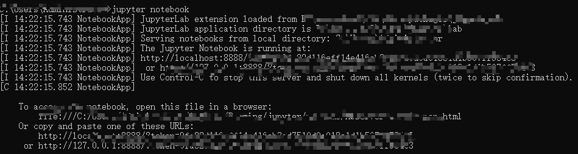

第二种：直接点击 `jupyter notebook` 打开

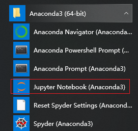


# `jupyter notebook` 主面板

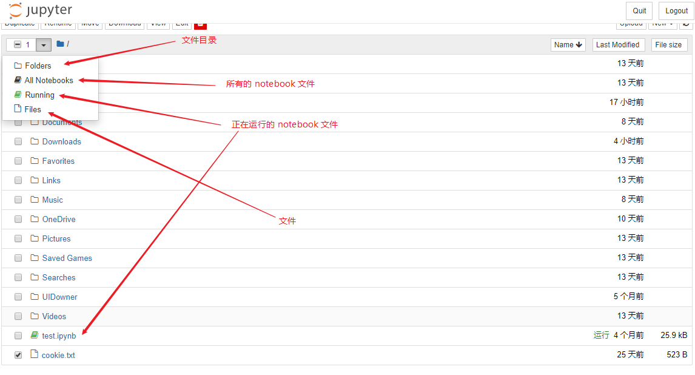

打开 `jupyter notebook` 主面板我们可以看到，左边下拉框展示

1. `Folder` 文件夹目录，你可以创建目录，删除目录等
2. `All Notebooks` 所有的 `notebook` 笔记本 
3. `Running` 正在运行中的 `notebook`
4. `Files` 文件，你可以创建，删除，修改文件等
5. `Clusters` 由 `IPython parallel` 包提供，用于并行计算

我们可以通过主面板右侧 `new` 选择 `python 3`,创建 `notebook`

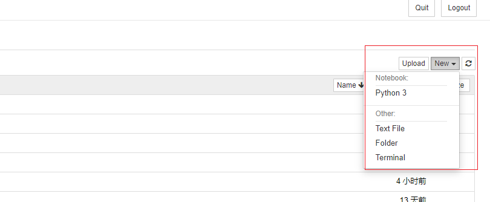

会生成一个 `notebook` 面板

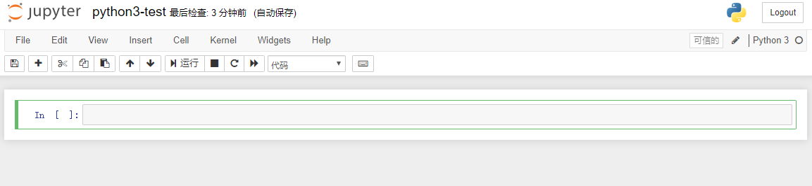

1. file 文件
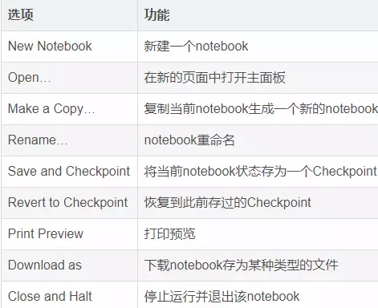
2. edit 编辑
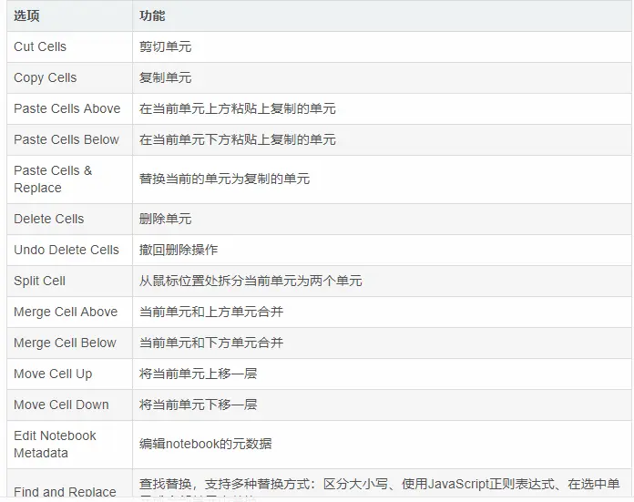
3. view 查看

4. insert 插入

5. cell 单元格

6. kernel 内核
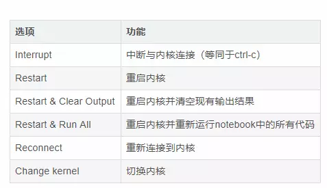
7. help 帮助
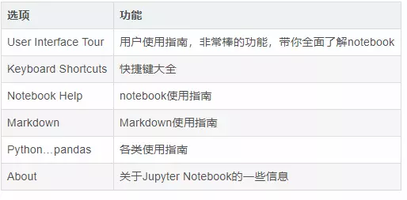

# 尝试代码

我们可以尝试输入以下代码
```
import matplotlib.pyplot as plt
import numpy as np
x = np.linspace(0, 5, 10)
y = x ** 2
axes.set_xlabel('x')
axes.set_ylabel('y')
axes.set_title('title');
```

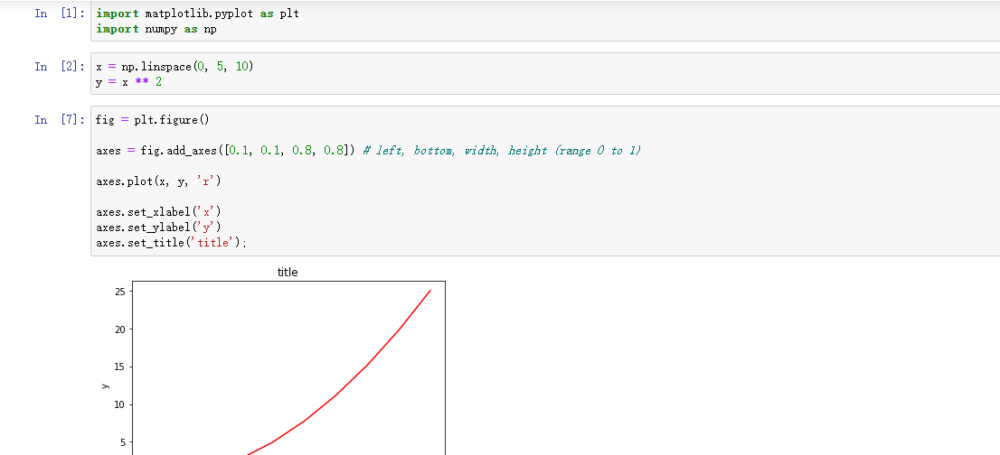

# 共享代码

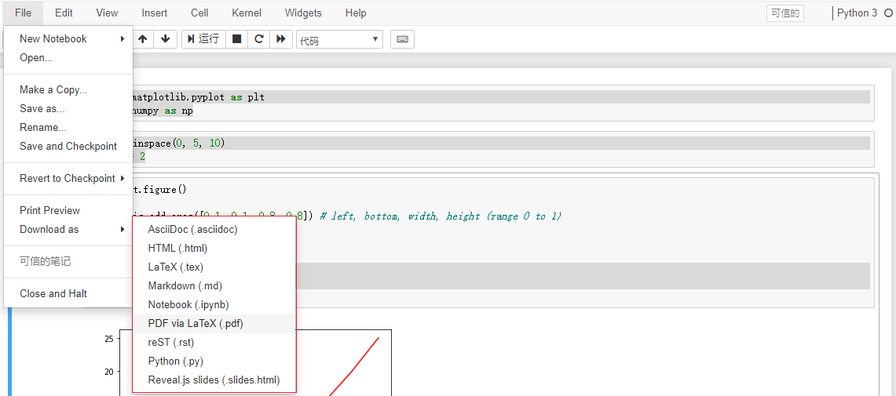