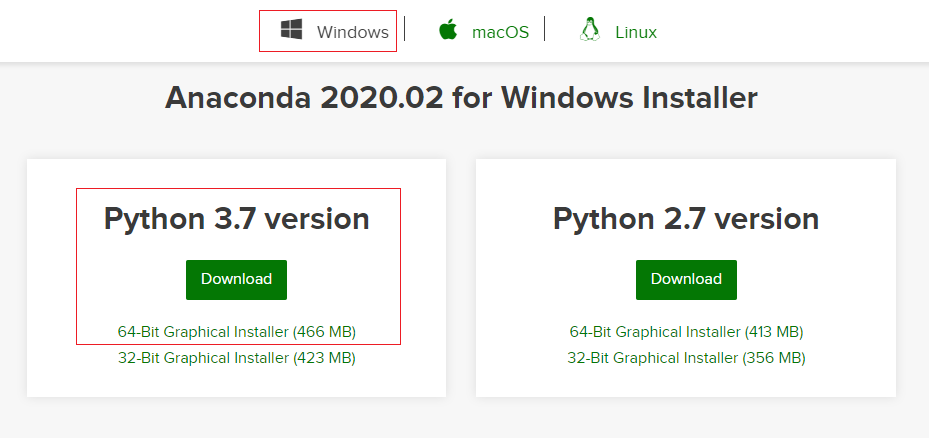
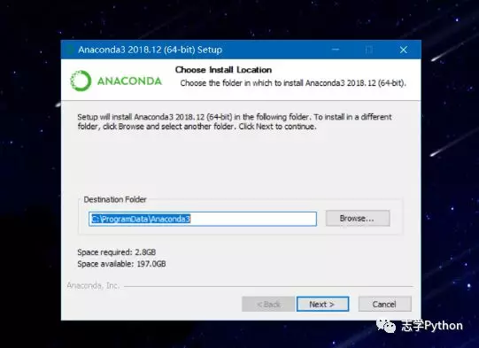
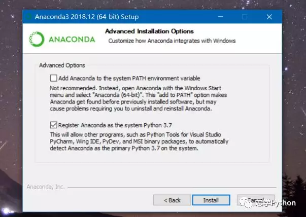
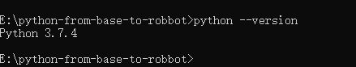
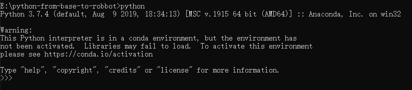
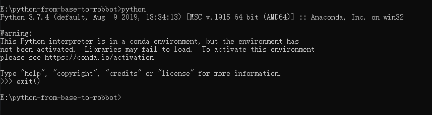
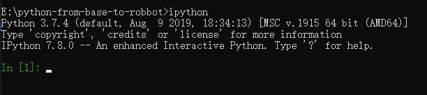
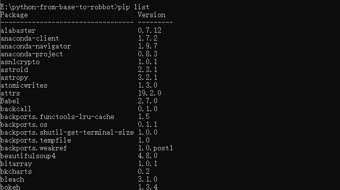

# 开发神器准备篇

工欲善其事，必先利其器

在开发程序之前，我们需要准备开发环境配置，编辑器安装，只有把准备工作做足，才有可能更加高效的开发应用程序。

在多数情况下，小白们很有可能就卡在配置环境这一环节中，浪费了很多时间，导致渐渐失去兴趣，结果不想学 python 了，所以接下来带大家一步一步的安装环境，开发利器


## 开发环境说明

* `windows 10`
* `anaconda 3`
* `python 3.7.4` (安装 `anaconda 3` 会自动集成 `python 3`)

## anaconda 3 简介
开源的 `Anaconda`个人版  （正式为`Anaconda`发行版）是在`Linux`，`Windows`和`Mac OS X`上执行`Python` / `R`数据科学和机器学习的最简单方法。它在全球拥有1900万用户，是开发的行业标准。在一台计算机上进行，测试和培训，使单个数据科学家能够：

- 快速下载7,500+个`Python` / R数据科学软件包
- 使用`Conda`管理库，依赖项和环境
- 使用`scikit-learn`，`TensorFlow`和`Theano`开发和训练机器学习和深度学习模型
- 使用`Dask`，`NumPy`，`pandas`和`Numba`分析具有可伸缩性和性能的数据
使用`Matplotlib`，`Bokeh`，`Datashader`和 `Holoviews`可视化结果

## 解决两大痛点

- 提供了包管理功能，Windows 平台安装第三方包经常失败的场景得以解决，

- 提供环境管理的功能，功能类似 Virtualenv，解决了多版本Python并存、切换的问题


## `anaconda3` 下载

首先：进入官网 `https://www.anaconda.com/distribution/`， 点击 `download` 下载

直接在官网下载安装包， 选择 `Python3.7` 的安装包进行下载，下载完成后直接安装，安装过程选择默认配置即可，大约需要1.8G的磁盘空间



# 安装

1.打开执行程序，点击 `Next`


2.点击 `I Agree`


3.选择用户权限，`All Users` 点击 `next`


4.选择磁盘，注意选一个大内存的磁盘，我通常会选择 D 作为软件安装的统一磁盘



5.终于来到安装




## anaconda test 

1.`win+r`,输入`cmd`,窗口输入`python`按回车查看是否安装成功 

```shell
python --version
```


```shell
python
```


```python3 
exit()
```


```shell
ipython
```


2.打开"开始"菜单，在`Anaconda3`文件下点击`Anaconda Prompt`，进入窗口后输入命令同dos窗口


3.输入pip list查看已安装的包



```python3
Package                            Version
---------------------------------- ---------
alabaster                          0.7.12
anaconda-client                    1.7.2
anaconda-navigator                 1.9.7
anaconda-project                   0.8.3
asn1crypto                         1.0.1
astroid                            2.3.1
astropy                            3.2.1
atomicwrites                       1.3.0
attrs                              19.2.0
Babel                              2.7.0
backcall                           0.1.0
backports.functools-lru-cache      1.5
backports.os                       0.1.1
backports.shutil-get-terminal-size 1.0.0
backports.tempfile                 1.0
backports.weakref                  1.0.post1
beautifulsoup4                     4.8.0
bitarray                           1.0.1
bkcharts                           0.2
bleach                             3.1.0
bokeh                              1.3.4
boto                               2.49.0
Bottleneck                         1.2.1
certifi                            2019.9.11
cffi                               1.12.3
chardet                            3.0.4
Click                              7.0
cloudpickle                        1.2.2
clyent                             1.2.2
colorama                           0.4.1
comtypes                           1.1.7
conda                              4.7.12
conda-build                        3.18.9
conda-package-handling             1.6.0
conda-verify                       3.4.2
contextlib2                        0.6.0
cryptography                       2.7
cycler                             0.10.0
Cython                             0.29.13
cytoolz                            0.10.0
dask                               2.5.2
decorator                          4.4.0
defusedxml                         0.6.0
distributed                        2.5.2
docutils                           0.15.2
entrypoints                        0.3
et-xmlfile                         1.0.1
fastcache                          1.1.0
filelock                           3.0.12
Flask                              1.1.1
fsspec                             0.5.2
future                             0.17.1
gevent                             1.4.0
glob2                              0.7
greenlet                           0.4.15
h5py                               2.9.0
HeapDict                           1.0.1
html5lib                           1.0.1
idna                               2.8
imageio                            2.6.0
imagesize                          1.1.0
importlib-metadata                 0.23
ipykernel                          5.1.2
ipython                            7.8.0
ipython-genutils                   0.2.0
ipywidgets                         7.5.1
isort                              4.3.21
itsdangerous                       1.1.0
jdcal                              1.4.1
jedi                               0.15.1
Jinja2                             2.10.3
joblib                             0.13.2
json5                              0.8.5
jsonschema                         3.0.2
jupyter                            1.0.0
jupyter-client                     5.3.3
jupyter-console                    6.0.0
jupyter-core                       4.5.0
jupyterlab                         1.1.4
jupyterlab-server                  1.0.6
keyring                            18.0.0
kiwisolver                         1.1.0
lazy-object-proxy                  1.4.2
libarchive-c                       2.8
llvmlite                           0.29.0
locket                             0.2.0
lxml                               4.4.1
MarkupSafe                         1.1.1
matplotlib                         3.1.1
mccabe                             0.6.1
menuinst                           1.4.16
mistune                            0.8.4
mkl-fft                            1.0.14
mkl-random                         1.1.0
mkl-service                        2.3.0
mock                               3.0.5
more-itertools                     7.2.0
mpmath                             1.1.0
msgpack                            0.6.1
multipledispatch                   0.6.0
mysql-connector-python             8.0.17
navigator-updater                  0.2.1
nbconvert                          5.6.0
nbformat                           4.4.0
networkx                           2.3
nltk                               3.4.5
nose                               1.3.7
notebook                           6.0.1
numba                              0.45.1
numexpr                            2.7.0
numpy                              1.16.5
numpydoc                           0.9.1
olefile                            0.46
openpyxl                           3.0.0
packaging                          19.2
pandas                             0.25.1
pandocfilters                      1.4.2
parso                              0.5.1
partd                              1.0.0
path.py                            12.0.1
pathlib2                           2.3.5
patsy                              0.5.1
pep8                               1.7.1
pickleshare                        0.7.5
Pillow                             6.2.0
pip                                19.2.3
pkginfo                            1.5.0.1
pluggy                             0.13.0
ply                                3.11
prometheus-client                  0.7.1
prompt-toolkit                     2.0.10
psutil                             5.6.3
py                                 1.8.0
pycodestyle                        2.5.0
pycosat                            0.6.3
pycparser                          2.19
pycrypto                           2.6.1
pycurl                             7.43.0.3
pyflakes                           2.1.1
Pygments                           2.4.2
pylint                             2.4.2
pyodbc                             4.0.27
pyOpenSSL                          19.0.0
pyparsing                          2.4.2
pyreadline                         2.1
pyrsistent                         0.15.4
PySocks                            1.7.1
pytest                             5.2.1
pytest-arraydiff                   0.3
pytest-astropy                     0.5.0
pytest-doctestplus                 0.4.0
pytest-openfiles                   0.4.0
pytest-remotedata                  0.3.2
python-dateutil                    2.8.0
pytz                               2019.3
PyWavelets                         1.0.3
pywin32                            223
pywinpty                           0.5.5
PyYAML                             5.1.2
pyzmq                              18.1.0
QtAwesome                          0.6.0
qtconsole                          4.5.5
QtPy                               1.9.0
requests                           2.22.0
rope                               0.14.0
ruamel-yaml                        0.15.46
scikit-image                       0.15.0
scikit-learn                       0.21.3
scipy                              1.3.1
seaborn                            0.9.0
selenium                           3.141.0
Send2Trash                         1.5.0
setuptools                         41.4.0
simplegeneric                      0.8.1
singledispatch                     3.4.0.3
six                                1.12.0
snowballstemmer                    2.0.0
sortedcollections                  1.1.2
sortedcontainers                   2.1.0
soupsieve                          1.9.3
Sphinx                             2.2.0
sphinxcontrib-applehelp            1.0.1
sphinxcontrib-devhelp              1.0.1
sphinxcontrib-htmlhelp             1.0.2
sphinxcontrib-jsmath               1.0.1
sphinxcontrib-qthelp               1.0.2
sphinxcontrib-serializinghtml      1.1.3
sphinxcontrib-websupport           1.1.2
spyder                             3.3.6
spyder-kernels                     0.5.2
SQLAlchemy                         1.3.9
statsmodels                        0.10.1
sympy                              1.4
tables                             3.5.2
tblib                              1.4.0
terminado                          0.8.2
testpath                           0.4.2
toolz                              0.10.0
tornado                            6.0.3
tqdm                               4.36.1
traitlets                          4.3.3
unicodecsv                         0.14.1
urllib3                            1.24.2
wcwidth                            0.1.7
webencodings                       0.5.1
Werkzeug                           0.16.0
wheel                              0.33.6
widgetsnbextension                 3.5.1
win-inet-pton                      1.1.0
win-unicode-console                0.5
wincertstore                       0.2
wrapt                              1.11.2
xlrd                               1.2.0
XlsxWriter                         1.2.1
xlwings                            0.15.10
xlwt                               1.3.0
zict                               1.0.0
zipp                               0.6.0
```


