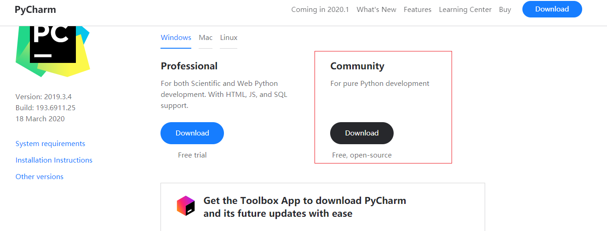
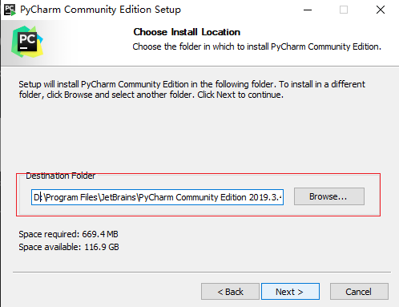
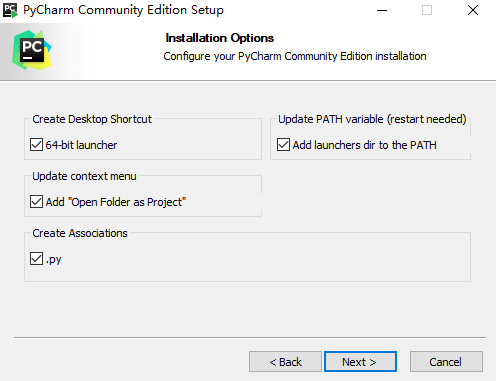
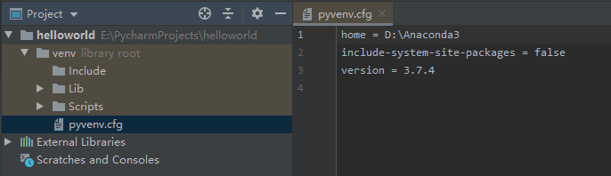

# `pyCharm` Code Editor

## `pyCharm` Introduction

`PyChart` is a `Python IDE` with a set of tools that help users improve their productivity when developing with the `Python` language, such as debugging, syntax highlighting, Project.Administration, code jumping, IntelliSense, AutoComplete, unit testing, version control. In addition, the `IDE`provides some advanced features to support professional Web development under the `Django` framework

## `pyCharm download`

go `pyCharm` Official website
 `https://www.jetbrains.com/pycharm/download/#section=windows` download `pycharm` Community edition

## Select a large disk to install `pycahrm`

## Select the installation option, all selected here

## After the installation is successful, we start creating a `project.`

## `pycharm` Partial shortcut key
1、`Ctrl + Enter`：Create a new line below without moving the cursor;

2、`Shift + Enter`：Create a new row below and move to the beginning of the new row;

3、`Ctrl + /`：The lines selected in the annotation (unannotation);

4、`Ctrl+d`：Copy the line of code on which the cursor is located.