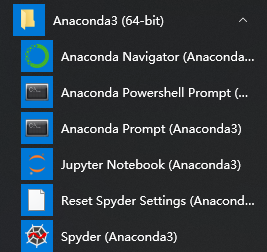
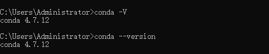
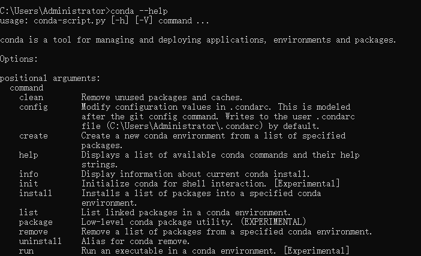
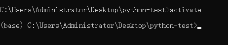
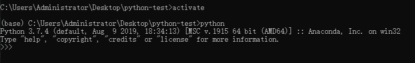
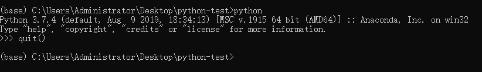
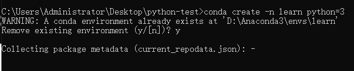

# `anaconda 3` 入门指南
## 前言

我们已经安装了 `anaconda 3`, 相信各位小伙伴已经迫不及待想要学习 `anaconda 3`, 这一章节就带大家来学习 `anacoda 3`一些基础指令，准备好了？

## `anaconda 3` 集成环境介绍

1. `anaconda navigator` 用于管理工具包的图形界面，类似于 git，mysql，等图形界面管理工具，很多命令都可以进行手动启动

2. `Jupyter notebook` 是基于 `web` 交互式环境，主要用于数据分析，图形展示，编辑文档等

3. `anaconda prompt` 是类似于 `windows cmd` 命令行窗口，可供直接输入指令，回车就能看到结果

4. `spyder` `蜘蛛` 是 `anaconda` 一个使用`Python`语言、跨平台的、科学运算集成开发环境



## 今天我们先来学习一下基础指令

通常我们安装一个应用程序之后，都要验证是否安装成功，类似像 `git`，`npm`，等管理工具，都会有一个版本号的，所以我们可以使用以下命令

```
conda --version 
# 或者
conda -V
```


还有一个更加强大的工具，这个工具相当于指令的说明书，我们可以通过这个指令来查看其他指令的说明

```
conda --help
# 或者
conda -h
```


接下来，我们创建虚拟环境，`anaconda` 自带一个命令,会进入一个名为 `base` 虚拟环境

```
activate
```


输入指令 `python`, 会出现 `python` 交互式计算控制台
```
python
```


如果不想停留在 `python` 解释器环境下，可以使用以下命令退出

```
exit()
# 或者
quit()
```



如果我们不满足于 `base` 环境，我们可以创建一个名为 `learn` 的虚拟环境，并指定 `python` 版本为 `3`

```
conda create -n learn python=3
```


激活环境

```
conda activate learn
```

退出环境

```
conda deactivate
```

安装 `package`
```
conda install requests
```

查看 `package list`

```
conda list
```


