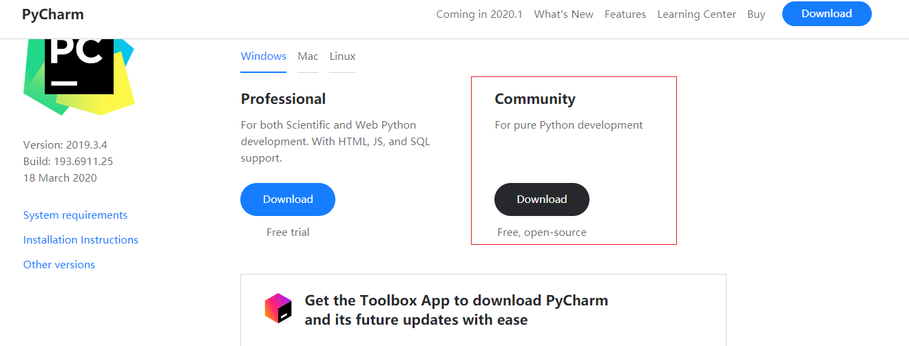
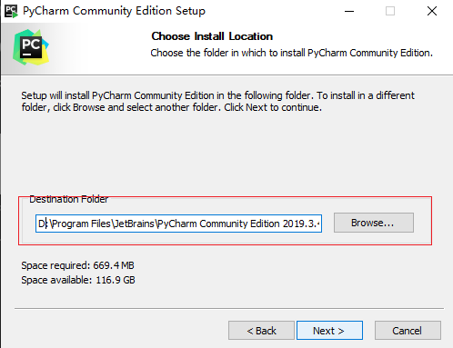
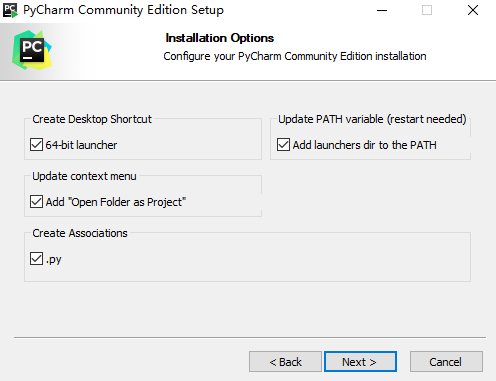
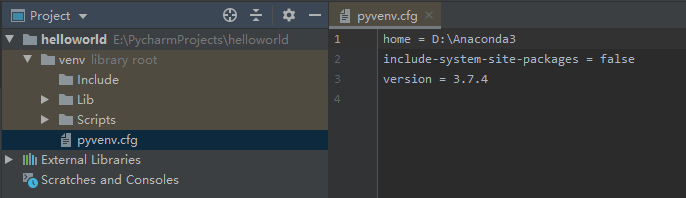

# `pyCharm` 代码编辑器

## `pyCharm` 简介

`PyCharm`是一种`Python IDE`，带有一整套可以帮助用户在使用`Python`语言开发时提高其效率的工具，比如调试、语法高亮、`Project`管理、代码跳转、智能提示、自动完成、单元测试、版本控制。此外，该`IDE`提供了一些高级功能，以用于支持`Django`框架下的专业Web开发

## `pyCharm download`

去到`pyCharm`官网 `https://www.jetbrains.com/pycharm/download/#section=windows` 下载 `pycharm` 社区版本

## 选择一个大的磁盘来安装`pycahrm`

## 选择安装选项，这里全部选中

## 安装成功之后，我们启动创建一个 `project`

## `pycharm` 部分快捷键
1、`Ctrl + Enter`：在下方新建行但不移动光标；

2、`Shift + Enter`：在下方新建行并移到新行行首；

3、`Ctrl + /`：注释(取消注释)选择的行；

4、`Ctrl+d`：对光标所在行的代码进行复制。